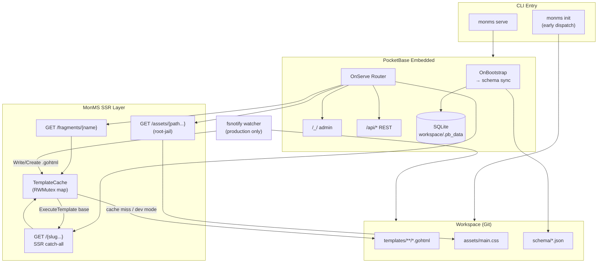

# Phase 1: Core Go Runtime & Workspace Foundation - Research

**Researched:** 2026-05-22
**Domain:** Go monolith runtime — PocketBase embedding, SSR html/template, fsnotify cache invalidation, workspace CLI
**Confidence:** HIGH

## Summary

Phase 1 is a greenfield Go binary with no existing source. The PRD (`specs/monms-prd.md` §3) provides a working reference for `TemplateCache`, SSR routing, static assets, and fsnotify — but CONTEXT.md overrides several PRD defaults: **ldflags `buildMode=production`** (not `ENV`), **`monms init` bootstrap** (not auto-scaffold), **nested mirror+index routing**, **fragment routes at `/fragments/{name}`**, **PocketBase data at `workspace/.pb_data/`**, and **fsnotify over the entire workspace** (not just `templates/`).

The recommended architecture splits concerns into a thin `main.go`, an early-dispatched `init` command (avoiding PocketBase bootstrap), and a `serve` path that embeds PocketBase via `pocketbase.NewWithConfig()` with `DefaultDataDir` pointed at `workspace/.pb_data`. Custom routes register in `OnServe()` with explicit ordering: `/assets/*` and `/fragments/*` before the SSR catch-all. Schema sync runs in `OnBootstrap()` after `e.Next()` using PocketBase's native `ImportCollectionsByMarshaledJSON()` — do not hand-roll collection CRUD.

fsnotify's `Add()` is **non-recursive** [CITED: context7.com/fsnotify/fsnotify] — a recursive `filepath.WalkDir` plus re-adding on `Create` events for new directories is required. Debouncing rapid Write events (100ms per path) is recommended for agent git commits [CITED: context7.com/fsnotify/fsnotify].

**Primary recommendation:** Start from PRD §3 reference code, adapt to CONTEXT decisions, use PocketBase `NewWithConfig` + `OnBootstrap`/`OnServe` hooks, early-dispatch `init` in `main()`, and stdlib `html/template` with `{{define "base"}}`/`{{define "body"}}` pattern executed via `ExecuteTemplate(w, "base", data)`.

## Architectural Responsibility Map

| Capability | Primary Tier | Secondary Tier | Rationale |
|------------|-------------|----------------|-----------|
| HTTP server & routing | API / Backend (embedded PocketBase) | — | PocketBase owns `net/http` mux; custom routes bind via `OnServe()` |
| PocketBase admin & REST API | API / Backend (PocketBase built-in) | — | `/_/`, `/api/*` are system routes — never reimplement |
| SSR template rendering | API / Backend | — | Server parses `.gohtml`, injects context, writes HTML response |
| Template cache & invalidation | API / Backend | Database / Storage (workspace FS) | In-memory cache in Go process; invalidation triggered by fsnotify on workspace files |
| Static asset serving | API / Backend | CDN / Static (workspace/assets) | Files read from disk; path-jail validation in handler |
| Workspace bootstrap (`monms init`) | API / Backend (CLI) | Database / Storage (workspace FS) | Writes scaffold files to disk; optional `git init` |
| Schema sync from JSON | API / Backend | Database / Storage (SQLite via PB) | Reads `workspace/schema/*.json`, imports via PocketBase API |
| Base layout & CDN scripts | Browser / Client | Frontend Server (SSR injects tags) | HTMX/Alpine/Tailwind loaded via CDN tags in `base.gohtml` |
| Dev vs production mode | API / Backend (compile-time) | — | `buildMode` ldflags toggles cache + watcher; not a client concern |

<user_constraints>
## User Constraints (from CONTEXT.md)

### Locked Decisions

#### Dev vs Production Mode
- **D-01:** Mode is auto-detected via compile-time ldflags — release builds set `-ldflags "-X main.buildMode=production"`; default/unset is development.
- **D-02:** Development mode never caches parsed templates — every request reads and parses from disk.
- **D-03:** Production mode uses in-memory template cache with `sync.RWMutex` (per PRD/ROADMAP).
- **D-04:** fsnotify watcher runs in production only — skip the goroutine entirely in development.

#### Workspace Bootstrap
- **D-05:** Workspace is created by a separate `monms init` command — the serve binary must not auto-scaffold.
- **D-06:** If workspace is missing or incomplete at startup, fatal exit with message directing user to run `monms init` (exit code 1).
- **D-07:** `monms init` generates full Phase 1 scaffold: `templates/layouts/base.gohtml`, `templates/index.gohtml` stub, `templates/errors/errors.gohtml`, `assets/main.css`, `schema/`, `templates/fragments/`, and placeholder files as needed.
- **D-08:** `monms init` runs `git init` in workspace only when `.git` does not already exist.
- **D-09:** Startup validates workspace structure — require `templates/layouts/base.gohtml` and `assets/` to exist before serving.

#### Route → Template Mapping
- **D-10:** Nested URL paths are supported with mirror + index convention — `/press` → `templates/press/index.gohtml`, `/press/2024` → `templates/press/2024.gohtml`.
- **D-11:** Homepage `/` and empty slug resolve to `templates/index.gohtml` at workspace root (not nested under `index/`).
- **D-12:** Trailing slashes are normalized — strip trailing slash before template lookup.
- **D-13:** URL slug case is preserved — filesystem case-sensitivity rules apply (Linux default).
- **D-14:** SSR catch-all must not intercept reserved prefixes — `/api/*`, `/_/*`, and `/assets/*` are excluded from SSR routing.
- **D-15:** Fragment partials are served at `/fragments/{name}` as HTMX swap targets in Phase 1.
- **D-16:** Template parse errors return HTTP 500 — show detailed error in dev mode, safe generic message in production.

#### Error Pages
- **D-17:** Unknown slugs return styled HTML via workspace template `templates/errors/errors.gohtml` wrapped in base layout, with `Code` and `Message` template variables.
- **D-18:** If workspace error template is missing, fall back to minimal built-in HTML 404.
- **D-19:** 404 pages display the attempted path (e.g., "Page not found: /missing-page") plus a link home.
- **D-20:** 500 errors reuse the same `errors.gohtml` layout with different `Code`/`Message` — no separate 500 template file.

#### Styling Baseline
- **D-21:** Hybrid styling — Tailwind preflight via CDN with minimal inline config in `base.gohtml`, plus `workspace/assets/main.css` for component classes (`.btn`, `.card`, `.hero`, etc.).
- **D-22:** Templates use minimal utility classes; branded/component styling lives in `main.css`.
- **D-23:** Alpine.js is included in `base.gohtml` with a minimal demo — simple mobile nav toggle in the index stub proves wiring (full editor UX deferred to Phase 3).
- **D-24:** HTMX CDN tag included in base layout per DEMO-03 (editor overlay block structure only — no auth badge logic until Phase 3).

#### Workspace Path & Data Layout
- **D-25:** Default workspace path is `./workspace` relative to process CWD.
- **D-26:** Workspace path is overridable via `MONMS_WORKSPACE` env var and `--workspace` CLI flag — flag overrides env when both set. Same resolution applies to `monms init` and serve.
- **D-27:** PocketBase data directory lives at `workspace/.pb_data/` — co-located with site workspace, not a sibling `./pb_data`.
- **D-28:** Operator manages `.gitignore` for `workspace/.pb_data/` — `monms init` does not auto-gitignore database files.
- **D-29:** Static asset serving uses root-jail validation — resolve absolute path and verify result stays under `workspace/assets/`; reject traversal with 403.
- **D-30:** fsnotify watches the entire workspace tree for `.gohtml` changes in production (not just `templates/` subdirectory).
- **D-31:** Startup logs both configured workspace path (env/flag value) and resolved absolute path at info level.
- **D-32:** `workspace/schema/` holds declarative JSON collection definitions — binary reads `schema/*.json` on startup to sync PocketBase collections in Phase 1.

### Claude's Discretion
- Exact Tailwind CDN script URL and inline config snippet for preflight-only setup.
- Built-in fallback 404/500 HTML markup when workspace error template is absent.
- `monms init` marker file format (if any beyond structural validation).
- fsnotify debouncing/coalescing strategy for rapid agent commits.
- Declarative schema sync error handling (log-and-continue vs fatal on invalid JSON).

### Deferred Ideas (OUT OF SCOPE)
None — discussion stayed within phase scope.
</user_constraints>

<phase_requirements>
## Phase Requirements

| ID | Description | Research Support |
|----|-------------|------------------|
| ENG-01 | Go binary starts and serves HTTP with PocketBase embedded without config files | `pocketbase.NewWithConfig` + `app.Start()` registers `serve` command; no external config needed [CITED: pocketbase.io/docs/go-overview] |
| ENG-02 | Template cache populated on first access, invalidated on workspace file changes | `TemplateCache` with lazy populate + fsnotify full flush pattern from PRD §3, adapted to D-30 whole-workspace watch |
| ENG-03 | fsnotify watches workspace templates folder, clears cache on write/create | fsnotify recursive walk + debounce; **note:** D-30 extends scope to entire workspace `.gohtml` files — implement D-30, satisfies ENG-03 |
| ENG-04 | Production mode activates caching; dev always reads from disk | ldflags `buildMode` per D-01/D-02/D-03 |
| ENG-05 | Idle RAM < 30MB in production | PocketBase baseline ~15-25MB [ASSUMED]; minimize goroutines, no dev logging; verify with `runtime.ReadMemStats` integration test |
| ENG-06 | SSR routes TTFB < 15ms under SQLite reads | Template cache in production avoids disk parse; Phase 1 index stub may skip DB reads; benchmark with `httptest` |
| WRK-01 | Workspace contains schema/, templates/layouts/, templates/fragments/, assets/ | `monms init` scaffold per D-07 |
| WRK-02 | Workspace is Git repo; agent mutations tracked as commits | `git init` when `.git` absent per D-08; Phase 2 adds commit automation |
| WRK-03 | Static assets served from workspace/assets/ without compilation | Custom `/assets/{path...}` handler with root-jail per D-29 |
| WRK-04 | Route templates resolved as templates/{slug}.gohtml merged with base layout | Resolver algorithm below; extended by D-10 nested mirror+index |
| WRK-05 | Unknown slug returns descriptive 404, no panic | Error handler via `errors.gohtml` per D-17–D-19; never panic on missing template |
| SEC-01 | PocketBase admin at `/_/` accessible | Built-in PocketBase route — no custom implementation [CITED: pocketbase.io/docs] |
| DEMO-03 | base.gohtml includes HTMX, Alpine.js CDN tags, editor overlay block structure | Scaffold in `monms init` per D-24; auth badge deferred to Phase 3 |
</phase_requirements>

## Standard Stack

### Core

| Library | Version | Purpose | Why Standard |
|---------|---------|---------|--------------|
| Go | 1.23+ (env: 1.25.6) | Language runtime | PocketBase requires Go 1.23+ [CITED: pocketbase.io/docs/go-overview] |
| `github.com/pocketbase/pocketbase` | **v0.38.1** | Embedded CMS, SQLite, admin, REST API | Project constraint; native collection import, routing hooks [VERIFIED: proxy.golang.org] |
| `github.com/fsnotify/fsnotify` | **v1.9.0** | Filesystem watch for cache invalidation | Cross-platform standard; used in PRD reference [VERIFIED: proxy.golang.org] |
| `github.com/spf13/cobra` | **v1.10.2** | CLI (`init`, `serve`) | PocketBase RootCmd is cobra-based; persistent flags pattern [VERIFIED: proxy.golang.org] |
| `html/template` (stdlib) | — | SSR template parsing/rendering | Zero-deps; auto-escaping; PRD reference uses it |
| `net/http` (stdlib) | — | HTTP (via PocketBase router) | PocketBase routing wraps Go 1.22+ ServeMux [CITED: pocketbase.io/docs/go-routing] |

### Supporting

| Library | Version | Purpose | When to Use |
|---------|---------|---------|-------------|
| `embed` (stdlib) | — | Embed init scaffold templates | `monms init` file generation without external assets |
| `path/filepath` (stdlib) | — | Path resolution, traversal checks | Asset jail, template resolution |
| `sync` (stdlib) | — | `RWMutex` for template cache | Production cache per D-03 |
| `log/slog` (stdlib) | — | Structured startup logging | D-31 workspace path logging |

### Alternatives Considered

| Instead of | Could Use | Tradeoff |
|------------|-----------|----------|
| stdlib `html/template` | PocketBase `tools/template` registry | PB registry is simpler for static view dirs; MonMS needs dynamic workspace paths and custom cache — stdlib is correct fit |
| PocketBase `ImportCollections` | REST POST /api/collections per file | Import is transactional, handles upsert; REST requires superuser auth at startup |
| ldflags buildMode | ENV=production | User locked ldflags in CONTEXT; ENV alone rejected |
| fsnotify | polling mtime | Polling adds latency and CPU; fsnotify is instant on git pull |

**Installation:**
```bash
go mod init github.com/monms/monms   # or project module path
go get github.com/pocketbase/pocketbase@v0.38.1
go get github.com/fsnotify/fsnotify@v1.9.0
# cobra comes transitively via pocketbase; pin explicitly if adding standalone init CLI
```

**Version verification:** Checked via `go list -m -versions` against proxy.golang.org on 2026-05-22. Latest stable: pocketbase v0.38.1, fsnotify v1.9.0, cobra v1.10.2.

## Architecture Patterns

### System Architecture Diagram



### Recommended Project Structure

```
/
├── main.go                      # buildMode var, CLI dispatch, PocketBase bootstrap
├── go.mod
├── go.sum
├── internal/
│   ├── config/
│   │   └── config.go            # workspace path resolution (env/flag/CWD)
│   ├── workspace/
│   │   └── validate.go          # D-09 structural validation
│   ├── templates/
│   │   ├── cache.go             # TemplateCache struct
│   │   ├── resolver.go          # slug → file path (D-10, D-11)
│   │   └── watcher.go           # fsnotify recursive + debounce
│   ├── router/
│   │   ├── ssr.go               # catch-all handler, error pages
│   │   ├── assets.go            # static files + path jail
│   │   └── fragments.go         # /fragments/{name}
│   ├── schema/
│   │   └── sync.go              # read schema/*.json → ImportCollections
│   └── scaffold/
│       ├── init.go              # monms init command
│       └── embed/               # embedded .gohtml, main.css templates
│           └── ...
└── workspace/                   # created by monms init (may be gitignored at engine level)
    ├── .pb_data/                # PocketBase SQLite (operator gitignores)
    ├── schema/
    ├── templates/
    │   ├── layouts/base.gohtml
    │   ├── fragments/
    │   ├── errors/errors.gohtml
    │   └── index.gohtml
    └── assets/main.css
```

### Pattern 1: Early-Dispatch CLI (init vs serve)

**What:** Check `os.Args[1] == "init"` in `main()` before creating PocketBase app. Run scaffold and exit. Only the serve path calls `pocketbase.NewWithConfig` + `app.Start()`.

**When to use:** Always — PocketBase `Execute()` bootstraps DB for every registered cobra command [CITED: github.com/pocketbase/pocketbase pocketbase.go]. `init` must not create `.pb_data` or run migrations.

**Example:**
```go
// Source: [CITED: pocketbase.io/docs/go-console-commands] + [VERIFIED: pocketbase.go Execute/bootstrap behavior]
func main() {
    if len(os.Args) >= 2 && os.Args[1] == "init" {
        if err := scaffold.RunInit(os.Args[2:]); err != nil {
            fmt.Fprintln(os.Stderr, err)
            os.Exit(1)
        }
        return
    }
    runServe()
}
```

### Pattern 2: PocketBase Config with Workspace-Scoped Data Dir

**What:** Set `DefaultDataDir` to `filepath.Join(workspaceAbs, ".pb_data")` via `NewWithConfig`.

**When to use:** Every serve startup per D-27.

**Example:**
```go
// Source: [VERIFIED: github.com/pocketbase/pocketbase v0.38.1 pocketbase.go]
app := pocketbase.NewWithConfig(pocketbase.Config{
    DefaultDataDir: filepath.Join(wsAbs, ".pb_data"),
    HideStartBanner: false,
})
```

### Pattern 3: Template Resolution (Mirror + Index)

**What:** Map URL path to filesystem path under `workspace/templates/`.

**When to use:** SSR catch-all handler for every non-reserved GET.

**Algorithm (in order):**
1. Strip trailing slash (D-12)
2. If slug empty → `templates/index.gohtml` (D-11)
3. Try `templates/{slug}.gohtml` (flat, WRK-04)
4. Try `templates/{slug}/index.gohtml` (directory index, D-10)
5. If not found → 404 via errors template (D-17)

**Examples:**
| URL | Resolved template |
|-----|-------------------|
| `/` | `templates/index.gohtml` |
| `/about` | `templates/about.gohtml` OR `templates/about/index.gohtml` (try flat first) |
| `/press` | `templates/press/index.gohtml` |
| `/press/2024` | `templates/press/2024.gohtml` |

**Recommendation for step 3 vs 4 ordering:** Try flat file first, then directory index — handles `/about` as either `about.gohtml` or `about/index.gohtml`. Document in planner: if both exist, flat wins.

### Pattern 4: Nested Layout Rendering

**What:** Parse layout + page together; execute the `"base"` template definition.

**When to use:** All full-page SSR responses and error pages.

**Example:**
```go
// Source: [CITED: pkg.go.dev/html/template] + PRD §3
layoutPath := filepath.Join(ws, "templates/layouts/base.gohtml")
pagePath := resolvedPagePath // from resolver

tmpl, err := template.ParseFiles(layoutPath, pagePath)
if err != nil {
    return renderError(w, 500, err, isDev)
}
return tmpl.ExecuteTemplate(w, "base", data)
```

**Template contract:**
- `base.gohtml`: `{{define "base"}}...{{template "body" .}}...{{end}}`
- Page: `{{define "title"}}...{{end}}` + `{{define "body"}}...{{end}}`
- Errors: `errors.gohtml` uses same `body` block with `{{.Code}}` and `{{.Message}}`

### Pattern 5: Schema Sync on Bootstrap

**What:** After PocketBase DB is ready, read all `workspace/schema/*.json`, merge into `[]map[string]any`, call `app.ImportCollections(data, false)`.

**When to use:** Every serve startup per D-32.

**Example:**
```go
// Source: [VERIFIED: github.com/pocketbase/pocketbase v0.38.1 core/collection_import.go]
app.OnBootstrap().BindFunc(func(e *core.BootstrapEvent) error {
    if err := e.Next(); err != nil {
        return err
    }
    raw, err := loadSchemaJSONFiles(filepath.Join(ws, "schema"))
    if err != nil || len(raw) == 0 {
        return nil // no schema files = no-op; ImportCollections rejects empty array
    }
    return e.App.ImportCollectionsByMarshaledJSON(raw, false)
})
```

**JSON format:** Use PocketBase `migrate collections` snapshot format — array of collection objects with `name`, `type`, `fields` keys [CITED: pocketbase.io/docs/go-migrations]. Support each file as either a single collection object or an array.

### Pattern 6: Recursive fsnotify with Debounce

**What:** Walk workspace tree, `watcher.Add(dir)` for each directory. On `Create` for new directories, add them. Filter events to `.gohtml` suffix. Debounce 100ms per file path before cache flush.

**When to use:** Production mode only (D-04). Watches entire workspace (D-30).

**Example:** See Code Examples section below.

### Anti-Patterns to Avoid

- **Registering SSR catch-all before system routes:** Register custom routes inside `OnServe()` — PocketBase system routes (`/api/`, `/_/`) register first and take precedence for matching paths [CITED: pocketbase.io/docs/go-routing]
- **Using `tmpl.Execute()` instead of `ExecuteTemplate("base")`:** With multiple files, Execute runs first defined template — use explicit template name
- **Single-directory fsnotify Add:** Misses nested template dirs — must walk and add all directories [CITED: context7.com/fsnotify/fsnotify]
- **Auto-scaffold on missing workspace:** Violates D-05/D-06 — fatal exit with `monms init` instructions
- **ENV-only production detection:** Violates D-01 — use ldflags

## Implementation Approaches (with Tradeoffs)

### A. CLI Structure

| Approach | Pros | Cons | Verdict |
|----------|------|------|---------|
| **Early dispatch `init` in main()** | No PocketBase bootstrap on init; fast; clean separation | Two CLI code paths | **Recommended** |
| Register `init` on `app.RootCmd` | Single cobra tree | Bootstraps DB/migrations on init unnecessarily [VERIFIED: pocketbase.go] | Avoid |
| Standalone cobra root wrapping PB | Full control over flags | More boilerplate duplicating PB `serve` flags | Optional if `--workspace` conflicts with PB flags |

**Recommendation:** Early dispatch for `init`. For `serve`, either pass through to PB's built-in `serve` subcommand (after setting `DefaultDataDir`) or register custom pre-serve validation hook. Add `--workspace` as a custom persistent flag parsed before PB init.

### B. `--workspace` Flag Integration

| Approach | Pros | Cons | Verdict |
|----------|------|------|---------|
| Parse `--workspace` before `app.Start()`, set `DefaultDataDir` | Simple, no PB flag conflicts | Must strip flag from `os.Args` before PB eager parse OR use env injection | **Recommended** |
| Use `MONMS_WORKSPACE` env only | Zero flag conflict | Violates D-26 CLI flag requirement | Partial — support both, flag wins |

**Recommendation:** Resolve workspace in `config.ResolveWorkspace(os.Args, os.Environ())` before PocketBase construction. Inject resolved path into `DefaultDataDir` and template paths.

### C. Schema Sync Error Handling (Claude's Discretion)

| Approach | Pros | Cons | Verdict |
|----------|------|------|---------|
| **Log-and-continue** on invalid JSON file | Server starts; operator can fix schema | Silent partial sync | **Recommended for Phase 1** — log file path + error at ERROR level |
| Fatal on any invalid JSON | Strong correctness | Blocks serve for one bad agent commit | Too strict for malleable CMS |
| Skip file, continue others | Resilient | Needs clear logging | Combine with log-and-continue |

### D. Tailwind CDN (Claude's Discretion)

| Approach | Pros | Cons | Verdict |
|----------|------|------|---------|
| **Tailwind v3 Play CDN** (`cdn.tailwindcss.com`) | Simple script tag; well-documented preflight toggle via `corePlugins` [CITED: tailwindcss.com/docs/installation/play-cdn] | v3 not latest | **Recommended** — hybrid with `main.css` per D-21 |
| Tailwind v4 Browser CDN | Modern | Layer-import config more complex [CITED: github.com/tailwindlabs/tailwindcss discussions] | Defer unless v3 insufficient |
| No Tailwind, CSS-only | Smallest CDN footprint | Violates D-21 hybrid styling | Rejected |

**Recommended base.gohtml CDN tags:**
```html
<script src="https://cdn.tailwindcss.com"></script>
<script>tailwind.config = { corePlugins: { preflight: true } }</script>
<link rel="stylesheet" href="/assets/main.css">
<script src="https://unpkg.com/htmx.org@1.9.12"></script>
<script defer src="https://cdn.jsdelivr.net/npm/alpinejs@3.14.8/dist/cdn.min.js"></script>
```
(Pin exact versions in scaffold — patch bumps are planner discretion.)

### E. Template Cache Key Strategy

| Approach | Pros | Cons | Verdict |
|----------|------|------|---------|
| Cache by slug string | Simple; matches URL | Same page file reachable via aliases? unlikely | **Recommended** |
| Cache by resolved file path | Handles duplicate slugs | More complex | Unnecessary for Phase 1 |
| Full cache flush on any .gohtml change | Correct; simple | Invalidates unrelated templates | **Recommended** per PRD — optimize in v2 (EXT-02) |

## Don't Hand-Roll

| Problem | Don't Build | Use Instead | Why |
|---------|-------------|-------------|-----|
| Admin UI & REST API | Custom admin panel | PocketBase built-in `/_/` and `/api/*` | SEC-01; years of auth, CRUD, file uploads |
| Collection schema sync | Manual SQL migrations | `ImportCollectionsByMarshaledJSON` | Transactional upsert, field merge, view ordering [VERIFIED: collection_import.go] |
| HTTP router | Custom mux | PocketBase `se.Router` on `OnServe` | Go 1.22 ServeMux, middleware, auth bindings |
| Template auto-escaping | Custom HTML sanitizer | `html/template` stdlib | Context-aware escaping built-in |
| File watch cross-platform | Polling loop | `fsnotify` | Platform-native inotify/kqueue/FSEvents |
| CLI framework | Custom arg parsing | cobra (via PocketBase or standalone) | POSIX flags, subcommands, help generation |
| Path traversal prevention | Ad-hoc string checks | `filepath.Clean` + absolute path prefix check | Handles `..`, symlinks edge cases |

**Key insight:** PocketBase already solves auth, DB, admin, and routing infrastructure. Phase 1 value is the workspace-driven SSR layer on top — not reimplementing CMS primitives.

## Common Pitfalls

### Pitfall 1: PocketBase Bootstrap on `init`
**What goes wrong:** Running `monms init` creates `.pb_data`, runs migrations, slows init, surprises operators.
**Why it happens:** `app.RootCmd.AddCommand(init)` + `app.Start()` bootstraps all non-skip commands.
**How to avoid:** Early dispatch `init` before PocketBase construction.
**Warning signs:** `.pb_data` appears after init; init takes >1s.

### Pitfall 2: Non-Recursive fsnotify
**What goes wrong:** Changes to `templates/press/2024.gohtml` don't invalidate cache.
**Why it happens:** `watcher.Add("./workspace")` only watches top-level; subdirs not monitored [CITED: fsnotify docs].
**How to avoid:** `filepath.WalkDir` to add all directories; re-add on `Create` for new dirs.
**Warning signs:** Only root-level template edits trigger reload.

### Pitfall 3: SSR Catch-All Shadowing API Routes
**What goes wrong:** `/api/collections` returns HTML error page.
**Why it happens:** Catch-all registered with higher priority or wrong pattern.
**How to avoid:** Register SSR last in `OnServe()`; use `/{slug...}` not `/{path...}` for pages; rely on PB system route registration order.
**Warning signs:** API clients receive `text/html` responses.

### Pitfall 4: Template Execute Without Layout
**What goes wrong:** Page renders without base layout; missing HTMX/Alpine.
**Why it happens:** `tmpl.Execute()` runs wrong definition.
**How to avoid:** Always `ExecuteTemplate(w, "base", data)`.
**Warning signs:** Raw `body` fragment without `<html>` wrapper.

### Pitfall 5: Asset Path Traversal
**What goes wrong:** `GET /assets/../../etc/passwd` leaks files.
**Why it happens:** Joining user path without jail check.
**How to avoid:** Resolve absolute path; verify `strings.HasPrefix(absPath, absAssetsDir+string(os.PathSeparator))`; return 403.
**Warning signs:** Security audit finds `..` in test requests succeed.

### Pitfall 6: Empty Schema Import Panic/Error
**What goes wrong:** Startup fails with "no collections to import".
**Why it happens:** `ImportCollections` rejects empty slice [VERIFIED: collection_import.go].
**How to avoid:** Skip import when `schema/` empty or no valid JSON files.
**Warning signs:** Fresh init without schema files cannot serve.

### Pitfall 7: ENG-03 vs D-30 Scope Mismatch
**What goes wrong:** Planner implements templates-only watch; misses layout changes in nested dirs outside templates/ (unlikely) or fragments.
**Why it happens:** REQUIREMENTS.md says `workspace/templates/`; CONTEXT D-30 says entire workspace.
**How to avoid:** Implement D-30 (whole workspace, filter `.gohtml`); satisfies ENG-03 intent.
**Warning signs:** Requirement traceability audit flags gap.

## Code Examples

### PocketBase Serve with Custom Routes

```go
// Source: [CITED: pocketbase.io/docs/go-event-hooks, go-routing]
app.OnServe().BindFunc(func(se *core.ServeEvent) error {
    se.Router.GET("/assets/{path...}", assetsHandler(ws))
    se.Router.GET("/fragments/{name}", fragmentsHandler(ws, tplCache))
    se.Router.GET("/{slug...}", ssrHandler(ws, tplCache))
    return se.Next()
})
```

### TemplateCache (Production/Dev + Lazy Populate)

```go
// Source: PRD §3 adapted for D-01 ldflags
var buildMode = "development"

type TemplateCache struct {
    mu     sync.RWMutex
    cache  map[string]*template.Template
}

func (c *TemplateCache) Active() bool { return buildMode == "production" }

func (c *TemplateCache) Get(key string, loader func() (*template.Template, error)) (*template.Template, error) {
    if c.Active() {
        c.mu.RLock()
        if t, ok := c.cache[key]; ok {
            c.mu.RUnlock()
            return t, nil
        }
        c.mu.RUnlock()
    }
    t, err := loader()
    if err != nil {
        return nil, err
    }
    if c.Active() {
        c.mu.Lock()
        if c.cache == nil {
            c.cache = make(map[string]*template.Template)
        }
        c.cache[key] = t
        c.mu.Unlock()
    }
    return t, nil
}

func (c *TemplateCache) Flush() {
    c.mu.Lock()
    c.cache = make(map[string]*template.Template)
    c.mu.Unlock()
}
```

### Asset Root-Jail

```go
// Source: [ASSUMED] standard Go path jail pattern — verify in tests
func safeAssetPath(assetsRoot, requestPath string) (string, error) {
    clean := filepath.Clean(filepath.Join(assetsRoot, requestPath))
    absRoot, err := filepath.Abs(assetsRoot)
    if err != nil {
        return "", err
    }
    absClean, err := filepath.Abs(clean)
    if err != nil {
        return "", err
    }
    if absClean != absRoot && !strings.HasPrefix(absClean, absRoot+string(os.PathSeparator)) {
        return "", errForbidden
    }
    return absClean, nil
}
```

### fsnotify Recursive Watch + Debounce

```go
// Source: [CITED: context7.com/fsnotify/fsnotify debounce example]
func watchWorkspace(ctx context.Context, root string, onChange func()) error {
    w, err := fsnotify.NewWatcher()
    if err != nil {
        return err
    }
    go func() {
        defer w.Close()
        var mu sync.Mutex
        timers := map[string]*time.Timer{}
        flush := func() { onChange() }
        for {
            select {
            case <-ctx.Done():
                return
            case e, ok := <-w.Events:
                if !ok {
                    return
                }
                if e.Has(fsnotify.Create) {
                    if fi, err := os.Stat(e.Name); err == nil && fi.IsDir() {
                        _ = w.Add(e.Name)
                    }
                }
                if !e.Has(fsnotify.Write) && !e.Has(fsnotify.Create) {
                    continue
                }
                if !strings.HasSuffix(e.Name, ".gohtml") {
                    continue
                }
                mu.Lock()
                if t, ok := timers[e.Name]; ok {
                    t.Reset(100 * time.Millisecond)
                } else {
                    timers[e.Name] = time.AfterFunc(100*time.Millisecond, func() {
                        flush()
                        mu.Lock()
                        delete(timers, e.Name)
                        mu.Unlock()
                    })
                }
                mu.Unlock()
            case _, ok := <-w.Errors:
                if !ok {
                    return
                }
            }
        }
    }()
    return filepath.WalkDir(root, func(path string, d fs.DirEntry, err error) error {
        if err != nil {
            return err
        }
        if d.IsDir() {
            return w.Add(path)
        }
        return nil
    })
}
```

### Workspace Validation (Fatal Exit)

```go
// Source: CONTEXT D-06, D-09
func ValidateWorkspace(ws string) error {
    checks := []string{
        filepath.Join(ws, "templates/layouts/base.gohtml"),
        filepath.Join(ws, "assets"),
    }
    for _, p := range checks {
        if _, err := os.Stat(p); err != nil {
            return fmt.Errorf("workspace incomplete: missing %s\nRun: monms init", p)
        }
    }
    return nil
}
```

### Build Commands

```bash
# Development (default buildMode=development)
go run . serve

# Production binary
go build -ldflags "-X main.buildMode=production" -o monms .

# Initialize workspace
go run . init
go run . init --workspace=/path/to/site
MONMS_WORKSPACE=/path/to/site go run . init
```

## Phase-Specific Recommendations

1. **Treat PRD §3 as starting point, not spec.** Replace `ENV=production` with ldflags; replace flat slug-only routing with mirror+index resolver; move pb_data into workspace; add init command and schema sync.

2. **Register routes in this order inside `OnServe()`:** `/assets/{path...}` → `/fragments/{name}` → `/{slug...}`. Do not register catch-all via `Router.Any` — GET only for SSR.

3. **Fragment handler:** Resolve `templates/fragments/{name}.gohtml`; render template directly (no base layout) for HTMX swap targets; 404 if missing.

4. **Error rendering:** Try parse `errors.gohtml` + `base.gohtml` with `{Code: 404, Message: "Page not found: /path"}`; fall back to minimal inline HTML per D-18.

5. **Index stub content:** Minimal hero + Alpine mobile nav toggle per D-23; no PocketBase record reads until Phase 3 (keeps ENG-06 measurable without DB).

6. **Schema folder in init:** Create empty `schema/.gitkeep` or include a commented example JSON — do not seed `hero_content` until Phase 3 (DEMO-01).

7. **Logging at startup (D-31):**
   ```go
   slog.Info("workspace configured", "path", cfgPath, "absolute", absPath, "mode", buildMode)
   ```

8. **Performance validation plan:** Add integration test `TestIdleMemoryUnder30MB` (parse `runtime.ReadMemStats` after GC, assert `< 30*1024*1024`) and `TestSSR_TTFB` with `httptest` (< 15ms, production build tag or ldflags in test).

9. **ROADMAP discrepancy:** ROADMAP mentions `ENV` env var for mode — **ignore**; CONTEXT D-01 locks ldflags. Planner should not reference ENV for mode toggle.

## State of the Art

| Old Approach | Current Approach | When Changed | Impact |
|--------------|------------------|--------------|--------|
| ENV-based production flag | ldflags `-X main.buildMode=production` | MonMS Phase 1 decision | Release pipeline must pass ldflags |
| pb_data sibling to workspace | `workspace/.pb_data/` | MonMS Phase 1 decision | `DefaultDataDir` must be workspace-relative |
| Flat slug routing only | Mirror + index nested routing | MonMS Phase 1 decision | Resolver logic needed |
| PRD: watch templates/ only | Watch entire workspace `.gohtml` | D-30 | Recursive fsnotify walk |
| PocketBase `DefaultDataDir()` setter | `NewWithConfig(Config{DefaultDataDir})` | PocketBase v0.7.2+ [CITED: GitHub #409] | Must use NewWithConfig |

**Deprecated/outdated:**
- PRD pb_data at repo root — superseded by D-27
- ROADMAP ENV toggle — superseded by D-01

## Assumptions Log

| # | Claim | Section | Risk if Wrong |
|---|-------|---------|---------------|
| A1 | PocketBase idle RAM ~15-25MB leaves headroom under 30MB target | ENG-05 | May need `HideStartBanner`, reduce DB pool limits in Config |
| A2 | Go 1.22+ ServeMux gives `/api/*` precedence over `/{slug...}` catch-all | Pitfall 3 | May need explicit route exclusions in SSR handler |
| A3 | Flat `{slug}.gohtml` checked before `{slug}/index.gohtml` is acceptable | Pattern 3 | Wrong page served if both exist — document precedence |
| A4 | Schema JSON uses `fields` key (not legacy `schema`) | Pattern 5 | Import fails — validate against `migrate collections` output |
| A5 | `init` early dispatch is acceptable vs cobra subcommand UX | Implementation A | Minor UX inconsistency (`monms init` vs `monms serve` through PB) |

## Open Questions

1. **Flat vs directory index precedence when both exist**
   - What we know: D-10 gives examples but not conflict resolution
   - What's unclear: `/about` with both `about.gohtml` and `about/index.gohtml`
   - Recommendation: Flat file wins; log debug when both exist (planner discretion)

2. **Schema sync with multiple JSON files defining same collection name**
   - What we know: ImportCollections upserts by id/name
   - What's unclear: Last-write-wins ordering
   - Recommendation: Load files in sorted name order; log merged count

3. **PocketBase `DefaultDev` auto-enables when using `go run`**
   - What we know: `pocketbase.New()` sets `DefaultDev: isUsingGoRun` [VERIFIED: pocketbase.go]
   - What's unclear: Whether PB dev mode SQL logging affects ENG-05 measurements
   - Recommendation: Use `NewWithConfig` with explicit `DefaultDev: buildMode != "production"` OR decouple MonMS buildMode from PB dev flag — planner should align both to production ldflags build

## Environment Availability

| Dependency | Required By | Available | Version | Fallback |
|------------|------------|-----------|---------|----------|
| Go | Build & test | ✓ | 1.25.6 | — |
| Git | `monms init` git init | ✓ | 2.53.0 | Skip git init if git missing; log warning |
| PocketBase (module) | ENG-01, SEC-01 | ✓ (via go mod) | v0.38.1 | — |
| C compiler (optional) | PocketBase SQLite driver | [ASSUMED] ✓ | — | Pure Go driver alternatives exist in PB docs |

**Missing dependencies with no fallback:**
- None identified — greenfield Go project, all deps fetched via `go mod`.

**Missing dependencies with fallback:**
- Git unavailable → init still scaffolds files; WRK-02 manual git init required.

## Validation Architecture

### Test Framework

| Property | Value |
|----------|-------|
| Framework | Go testing (stdlib) |
| Config file | none — see Wave 0 |
| Quick run command | `go test ./... -count=1 -short` |
| Full suite command | `go test ./... -count=1 -race` |

### Phase Requirements → Test Map

| Req ID | Behavior | Test Type | Automated Command | File Exists? |
|--------|----------|-----------|-------------------|-------------|
| ENG-01 | Binary serves HTTP with PocketBase | integration | `go test ./internal/router/... -run TestServeStarts -count=1` | ❌ Wave 0 |
| ENG-02 | Cache populate + invalidate | unit | `go test ./internal/templates/... -run TestCacheFlush -count=1` | ❌ Wave 0 |
| ENG-03 | fsnotify triggers flush on .gohtml write | integration | `go test ./internal/templates/... -run TestWatcherInvalidates -count=1` | ❌ Wave 0 |
| ENG-04 | Dev reads disk; prod caches | unit | `go test ./internal/templates/... -run TestDevNoCache -count=1` | ❌ Wave 0 |
| ENG-05 | Idle RAM < 30MB | integration | `go test ./... -run TestIdleMemory -count=1` | ❌ Wave 0 |
| ENG-06 | TTFB < 15ms | integration | `go test ./internal/router/... -run TestTTFB -count=1` | ❌ Wave 0 |
| WRK-01 | Init creates directory structure | unit | `go test ./internal/scaffold/... -run TestInitScaffold -count=1` | ❌ Wave 0 |
| WRK-02 | Init runs git init when no .git | unit | `go test ./internal/scaffold/... -run TestInitGit -count=1` | ❌ Wave 0 |
| WRK-03 | Assets served from workspace/assets | integration | `go test ./internal/router/... -run TestAssetsHandler -count=1` | ❌ Wave 0 |
| WRK-04 | Slug resolves to template + layout | unit | `go test ./internal/templates/... -run TestResolveSlug -count=1` | ❌ Wave 0 |
| WRK-05 | Unknown slug → 404 HTML, no panic | integration | `go test ./internal/router/... -run Test404NoPanic -count=1` | ❌ Wave 0 |
| SEC-01 | Admin route accessible | smoke | `go test ./internal/router/... -run TestAdminDashboard -count=1` | ❌ Wave 0 |
| DEMO-03 | base.gohtml contains HTMX/Alpine tags | unit | `go test ./internal/scaffold/... -run TestBaseLayoutCDN -count=1` | ❌ Wave 0 |

### Sampling Rate

- **Per task commit:** `go test ./... -short -count=1`
- **Per wave merge:** `go test ./... -count=1 -race`
- **Phase gate:** Full suite green; manual smoke: `monms init && monms serve`, curl `/`, `/_/`, `/assets/main.css`

### Wave 0 Gaps

- [ ] `go.mod` / module initialization — no Go module exists yet
- [ ] `internal/templates/cache_test.go` — ENG-02, ENG-04
- [ ] `internal/templates/resolver_test.go` — WRK-04, D-10 nested paths
- [ ] `internal/templates/watcher_test.go` — ENG-03
- [ ] `internal/router/handlers_test.go` — ENG-01, WRK-03, WRK-05, SEC-01
- [ ] `internal/scaffold/init_test.go` — WRK-01, WRK-02, DEMO-03
- [ ] `internal/router/perf_test.go` — ENG-05, ENG-06 benchmarks
- [ ] Test helper: temp workspace fixture with scaffold files
- [ ] Build tag or test ldflags helper for production mode tests

## Security Domain

### Applicable ASVS Categories

| ASVS Category | Applies | Standard Control |
|---------------|---------|------------------|
| V2 Authentication | no (Phase 1) | PocketBase auth deferred to Phase 3 |
| V3 Session Management | no (Phase 1) | — |
| V4 Access Control | partial | Asset path jail (D-29); SSR reserved prefix exclusion (D-14) |
| V5 Input Validation | yes | Path slug validation; reject traversal in asset handler; safe 500 messages in production (D-16) |
| V6 Cryptography | no (Phase 1) | PocketBase handles at rest via SQLite |

### Known Threat Patterns

| Pattern | STRIDE | Standard Mitigation |
|---------|--------|---------------------|
| Path traversal via `/assets/../../` | Tampering / Info disclosure | Absolute path prefix jail [D-29] |
| Template parse error info leak | Info disclosure | Generic 500 in production [D-16] |
| SSRF via catch-all | — | Not applicable — no outbound fetch |
| XSS in templates | Tampering | `html/template` auto-escaping — use html not text template |

## Sources

### Primary (HIGH confidence)
- `/websites/pocketbase_io` via Context7 — Go overview, routing, event hooks, collections, migrations, console commands
- `github.com/pocketbase/pocketbase v0.38.1` — `pocketbase.go`, `core/collection_import.go` [VERIFIED: GitHub raw]
- `/fsnotify/fsnotify` via Context7 — Add semantics, debounce pattern
- `/spf13/cobra` via Context7 — persistent flags, subcommands
- `specs/monms-prd.md` §2–§3 — reference implementation

### Secondary (MEDIUM confidence)
- [pkg.go.dev/html/template](https://pkg.go.dev/html/template) — nested template defines
- [tailwindcss.com Play CDN docs](https://tailwindcss.com/docs/installation/play-cdn) — CDN setup
- proxy.golang.org — module version verification

### Tertiary (LOW confidence)
- PocketBase idle RAM footprint estimate — needs Phase 1 benchmark validation

## Metadata

**Confidence breakdown:**
- Standard stack: **HIGH** — verified module versions, official PocketBase embedding docs
- Architecture: **HIGH** — PRD reference + CONTEXT decisions + verified PocketBase hook patterns
- Pitfalls: **HIGH** — fsnotify non-recursive documented; bootstrap-on-init verified in source

**Research date:** 2026-05-22
**Valid until:** 2026-06-22 (PocketBase moves quickly — re-verify if planning delayed >30 days)
