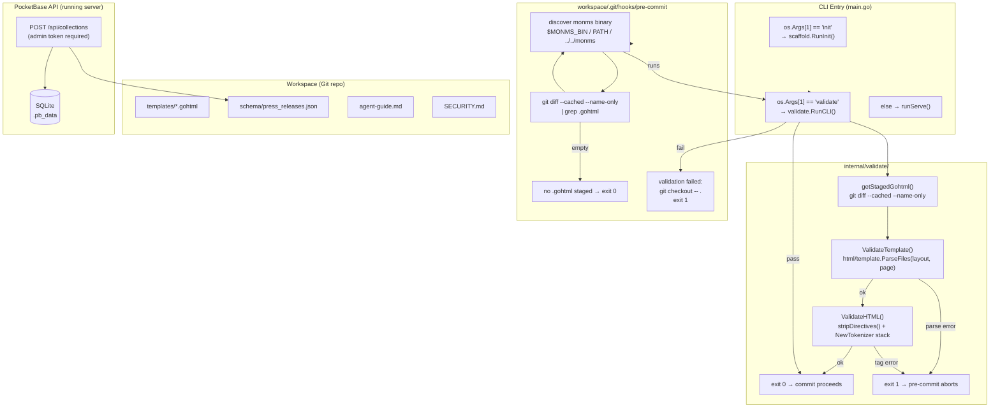

# Phase 2: Agent Mutation Engine & Safety Guardrails - Research

**Researched:** 2026-05-22
**Domain:** Go CLI subcommand, html/template dry-run, golang.org/x/net/html tokenizer, git pre-commit hooks, PocketBase REST collection API, workspace documentation
**Confidence:** HIGH

---

<user_constraints>
## User Constraints (from CONTEXT.md)

### Locked Decisions

#### Schema Mutation Workflow
- **D-33:** Agent schema mutations use **dual-write**: POST to `/api/collections` for immediate live effect (AGT-01, no restart), then write matching `workspace/schema/{collection_name}.json` in the same atomic mutation unit for Git audit trail and D-32 bootstrap sync compatibility.
- **D-34:** Schema JSON files must match the format consumed by `internal/schema/sync.go` — single collection object or array batch per file; invalid JSON is log-and-continue on serve (Phase 1 behavior), but pre-commit validation for schema files is out of scope unless the agent modifies them in the same commit as templates.
- **D-35:** Collection creation sample walkthrough uses `press_releases` with `title` (text) and `body` (text) fields — canonical example in `workspace/agent-guide.md` and integration test fixture.

#### Validation Toolchain
- **D-36:** Validation is an integrated **`monms validate`** CLI subcommand in the engine binary — not a separate script or npm dependency. Zero Node.js pipeline required.
- **D-37:** Template dry-run reuses production parse path: for each staged/modified `*.gohtml`, parse with `templates/layouts/base.gohtml` via `html/template.ParseFiles` matching `internal/router/ssr.go` loader — no PocketBase server required (AGT-03).
- **D-38:** HTML structure check uses Go `golang.org/x/net/html` tokenizer/parser for well-formedness (balanced tags, valid nesting) on modified `.gohtml` files — no external `html-validator` npm package (AGT-04). Fail on parse errors with file path and line context in stderr.
- **D-39:** `monms validate` accepts `--workspace` flag (same resolution as serve/init per D-26) and optionally `--files` for explicit paths; default reads git-staged `.gohtml` paths from workspace repo when invoked from pre-commit hook.

#### Pre-Commit Hook Lifecycle
- **D-40:** `monms init` installs an executable `workspace/.git/hooks/pre-commit` when git is initialized (extends D-08) — idempotent: skip if hook exists and contains `monms-validate-hook` marker, otherwise write/update.
- **D-41:** Pre-commit hook runs `monms validate` against staged `*.gohtml` files only — schema-only or CSS-only commits skip template validation unless `.gohtml` staged.
- **D-42:** Hook discovers `monms` binary via `$MONMS_BIN` env var if set, else `command -v monms`, else relative `../../monms` from workspace (document all three in agent-guide). Fail loudly if binary not found.

#### Rollback & Failure Handling
- **D-43:** On any validation failure, pre-commit hook runs `git checkout -- .` in workspace root to restore entire working tree (AGT-05), then exits non-zero with validation errors printed — matches PRD instant revert semantics.
- **D-44:** Rollback is all-or-nothing — no partial file restore or staged-only reset. Agent must re-apply mutation after fixing validation errors.
- **D-45:** Successful validation allows commit to proceed; agent uses descriptive commit messages with `agent:` prefix, e.g. `agent: add press_releases collection and press index template` (AGT-06).

#### Agent Documentation & Security
- **D-46:** `workspace/agent-guide.md` documents end-to-end mutation workflow: read current state → dual-write schema → edit templates following D-10/D-11 routing conventions → run `monms validate` manually before commit → git commit → verify in browser.
- **D-47:** Template editing conventions in agent-guide: always use `{{define "body"}}` in page templates, extend `base.gohtml` layout, HTMX fetch patterns for collection lists, mirror+index slug rules from Phase 1.
- **D-48:** `workspace/SECURITY.md` documents SEC-03: dedicated SSH key restricted to workspace subdirectory only, PocketBase admin API token stored outside git (env/vault), token scoped to collection management, rotate on compromise, never commit `.pb_data/` or credentials.
- **D-49:** Phase 2 validates the sample `press_releases` operation via integration test — POST collection (or schema import), commit template, pre-commit passes, page renders without restart (AGT-02).

### Claude's Discretion
- Exact stderr message format and exit codes for `monms validate`.
- Whether to add `--fix` or `--verbose` flags on validate subcommand.
- Pre-commit hook shell vs embedded script content (bash assumed available).
- Integration test harness: httptest against running PocketBase vs mock — prefer real embedded PocketBase in testutil pattern from Phase 1.
- Agent-guide tone and section ordering beyond required walkthrough content.

### Deferred Ideas (OUT OF SCOPE)
- **EXT-01 REST webhook / chatbox git rollback** — v2 backlog; Phase 2 only documents manual `git log` / `git revert` in SECURITY.md as operator escape hatch
- **Automatic git commits on human inline edits** — PRD NFR §7.2 mentions; belongs to Phase 3 inline editing workflow
- **Chatbox or in-app agent API hook** — PRD §4 describes future interaction layer; Phase 2 documents external agent workflow only
- **Schema JSON pre-commit validation** — useful but not AGT requirement; defer unless planner finds low-cost addition
- **Agent-managed CSS variable theming (EXT-03)** — v2 backlog
</user_constraints>

<phase_requirements>
## Phase Requirements

| ID | Description | Research Support |
|----|-------------|------------------|
| AGT-01 | Agent can create a new PocketBase collection by POSTing to `/api/collections` without restarting the binary | PocketBase REST API `/api/collections` accepts POST; `ImportCollectionsByMarshaledJSON` as Go API equivalent for integration tests [CITED: pocketbase.io/docs] |
| AGT-02 | Agent can modify an existing `*.gohtml` template and the change is visible on the next browser request without restart | Phase 1 fsnotify cache flush already handles this — no new work; validated by integration test GET after template write |
| AGT-03 | Before committing, agent runs Go HTML template dry-run validation on modified templates | `html/template.ParseFiles(layoutPath, pagePath)` returns error on syntax failure; no server required — exact production path from `ssr.go` |
| AGT-04 | Before committing, agent runs an HTML structure linter on modified templates | `golang.org/x/net/html` tokenizer (already in go.mod v0.54.0) with void-element-aware tag stack; strip `{{...}}` directives before tokenizing |
| AGT-05 | On validation failure, agent performs `git checkout -- .` to restore the last stable workspace state | Pre-commit hook `exit 1` after `git checkout -- .`; tested via integration test with a deliberately broken template |
| AGT-06 | All agent file mutations are committed to git with descriptive commit messages | Documented in agent-guide.md: `agent:` prefix convention; enforced by documentation, not tooling (per D-45) |
| SEC-03 | Agent operates with SSH keys and REST API tokens scoped strictly to the active workspace subdirectory | `workspace/SECURITY.md` documents scope requirements per D-48; no binary enforcement in Phase 2 |
</phase_requirements>

---

## Summary

Phase 2 builds on the Phase 1 foundation to make the workspace mutation pipeline safe. The work is primarily in four areas: (1) a new `internal/validate/` package implementing template dry-run and HTML tokenizer checks, (2) a `monms validate` CLI subcommand dispatched early in `main.go` following the existing `init` pattern, (3) a bash pre-commit hook installed by `monms init` into `workspace/.git/hooks/`, and (4) two workspace documentation files (`agent-guide.md`, `SECURITY.md`) plus the `press_releases` integration test.

No new Go module dependencies are required. `golang.org/x/net/html` (v0.54.0) is already a transitive dependency of PocketBase in `go.mod`. All validation logic uses stdlib `html/template`, stdlib `os/exec`, and the existing x/net/html package. The integration test pattern is established in `internal/router/handlers_test.go` with `startTestServer()` and `app.Bootstrap()`.

The critical technical decision for HTML well-formedness (D-38) is the approach to handling Go template directives (`{{define "body"}}...{{end}}`) before HTML checking. `html.Parse()` follows HTML5 error correction and is too lenient for catching malformed templates — it silently adds missing tags. The recommended approach is `html.NewTokenizer` with a void-element-aware tag-balance stack, with `{{...}}` directives pre-stripped via regexp before tokenizing.

**Primary recommendation:** Structure as `internal/validate/validate.go` (pure functions, no I/O), `internal/validate/cmd.go` (CLI wiring, flag parsing, staged-file discovery via `git diff --cached`), and extend `internal/scaffold/init.go`'s `maybeGitInit` to also call `installPreCommitHook`. The validate subcommand is early-dispatched in `main.go` like `init`.

## Architectural Responsibility Map

| Capability | Primary Tier | Secondary Tier | Rationale |
|------------|-------------|----------------|-----------|
| Template dry-run validation | API / Backend (CLI) | — | Pure Go parse call; reads workspace files; no HTTP |
| HTML structure checking | API / Backend (CLI) | — | Go tokenizer on local `.gohtml` files; no external service |
| Pre-commit hook execution | Database / Storage (workspace FS) | API / Backend (invokes binary) | Hook lives in `workspace/.git/hooks/`; calls monms binary |
| Pre-commit hook installation | API / Backend (CLI) | Database / Storage (workspace FS) | `monms init` writes hook file to `workspace/.git/hooks/` |
| Git rollback on failure | Database / Storage (workspace FS) | — | `git checkout -- .` runs in workspace; no Go code involved |
| Schema dual-write | API / Backend | Database / Storage (workspace FS + SQLite) | POST to PocketBase REST; then write `.json` to workspace |
| PocketBase collection creation | API / Backend (PocketBase built-in) | Database / Storage (SQLite) | PocketBase owns collection CRUD; no custom implementation |
| Agent documentation | Database / Storage (workspace FS) | — | Static Markdown files written to workspace |

---

## Standard Stack

### Core (Phase 2 — no new modules required)

| Library | Version | Purpose | Why Standard |
|---------|---------|---------|--------------|
| `html/template` (stdlib) | — | Template dry-run parse (D-37) | Same library used in `ssr.go`; zero deps |
| `golang.org/x/net/html` | **v0.54.0** (existing) | HTML tokenizer for well-formedness (D-38) | Already in go.mod as transitive PocketBase dep; no new `go get` needed [VERIFIED: go.mod] |
| `os/exec` (stdlib) | — | `git diff --cached` in validate subcommand | Subprocess for Git staged-file discovery |
| `regexp` (stdlib) | — | Strip `{{...}}` template directives before HTML tokenizing | No external parser needed for directive stripping |
| `bytes`, `io` (stdlib) | — | Feed stripped content to tokenizer | |

### No New Dependencies

The Phase 2 implementation requires zero new `go get` additions. All required libraries are either Go stdlib or already present in `go.mod`. The ROADMAP.md mentions "html-validator" npm — **this is superseded by D-38 (locked): use `golang.org/x/net/html` instead**. No Node.js in the toolchain.

**Version verification:** `golang.org/x/net v0.54.0` confirmed in go.mod. `go doc golang.org/x/net/html` returns full package docs including `Parse`, `NewTokenizer`, `ErrorToken`. [VERIFIED: go.mod, go doc]

---

## Architecture Patterns

### System Architecture Diagram



### Recommended Project Structure (additions to Phase 1)

```
internal/
├── validate/
│   ├── validate.go          # ValidateTemplate(), ValidateHTML() — pure functions, no I/O
│   ├── cmd.go               # RunCLI(args []string) — flag parsing, staged-file discovery
│   └── validate_test.go     # Unit tests for dry-run and HTML tokenizer
workspace/
├── agent-guide.md           # D-46: end-to-end mutation workflow
├── SECURITY.md              # D-48: SEC-03 SSH key + API token scope
└── schema/
    └── press_releases.json  # D-35: canonical integration test fixture
```

`internal/scaffold/init.go` gains one new exported function:
```
installPreCommitHook(wsRoot string) error   # called after maybeGitInit()
```

`main.go` gains one early-dispatch arm for `validate`:
```go
if len(os.Args) >= 2 && os.Args[1] == "validate" {
    if err := validate.RunCLI(os.Args[2:]); err != nil { ... }
    return
}
```

### Pattern 1: Template Dry-Run Validation (D-37)

**What:** Call `html/template.ParseFiles(layoutPath, pagePath)` for each `.gohtml` file. If `err != nil`, template syntax is invalid.

**When to use:** Every `.gohtml` file staged for commit; also callable manually pre-commit.

**Key insight:** This is identical to the production path in `internal/router/ssr.go`. A file that passes dry-run will parse the same way at serve time. No PocketBase running, no HTTP, no data context required.

```go
// Source: mirrors internal/router/ssr.go loader func
func ValidateTemplate(wsAbs, filePath string) error {
    layoutPath := filepath.Join(wsAbs, "templates", "layouts", "base.gohtml")
    if _, err := template.ParseFiles(layoutPath, filePath); err != nil {
        return fmt.Errorf("%s: template parse error: %w", filepath.Base(filePath), err)
    }
    return nil
}
```

**Error format example (stderr):** `press/index.gohtml: template parse error: template: index.gohtml:4: unexpected EOF`

### Pattern 2: HTML Well-Formedness Check (D-38)

**What:** Strip Go template directives (`{{...}}`), then use `golang.org/x/net/html.NewTokenizer` with a void-element-aware tag stack to verify balanced open/close tags.

**Why not `html.Parse()`:** `html.Parse()` implements the HTML5 error-correction algorithm and silently fixes malformed markup (e.g., adds implicit `<body>`, repairs unclosed tags). It never returns an error for structural problems — only for reader I/O errors. [VERIFIED: go doc golang.org/x/net/html.Parse, x/net/html source]

**Why not walk for `ErrorNode`:** `html.Parse()` does not create `ErrorNode` entries in the result tree for template-file fragments (partial HTML); it wraps the content in implicit `html/head/body`. `ErrorNode` is the zero value of `NodeType` and rarely appears in practice after a successful `Parse()` call. [VERIFIED: x/net/html NodeType constants]

**Tokenizer approach (recommended):**

```go
// Source: [CITED: pkg.go.dev/golang.org/x/net/html] + void-element list from HTML5 spec
var voidElements = map[string]bool{
    "area": true, "base": true, "br": true, "col": true,
    "embed": true, "hr": true, "img": true, "input": true,
    "link": true, "meta": true, "param": true, "source": true,
    "track": true, "wbr": true,
}

// templateDirectiveRE strips {{...}} blocks before HTML tokenizing.
// Multi-line directives ({{range .}}...{{end}}) need the s/DOTALL flag.
var templateDirectiveRE = regexp.MustCompile(`(?s)\{\{.*?\}\}`)

func ValidateHTML(filePath string, content []byte) error {
    // Step 1: strip template directives so tokenizer sees clean HTML
    stripped := templateDirectiveRE.ReplaceAll(content, []byte(" "))

    // Step 2: tag-balance check using tokenizer
    z := gohtml.NewTokenizer(bytes.NewReader(stripped))
    var stack []string
    var errs []error

    for {
        tt := z.Next()
        switch tt {
        case gohtml.ErrorToken:
            if z.Err() == io.EOF {
                goto done
            }
            errs = append(errs, fmt.Errorf("tokenizer error: %w", z.Err()))
            goto done
        case gohtml.StartTagToken:
            rawName, selfClosing := z.TagName()
            name := string(rawName)
            if !selfClosing && !voidElements[name] {
                stack = append(stack, name)
            }
        case gohtml.EndTagToken:
            rawName, _ := z.TagName()
            name := string(rawName)
            if len(stack) == 0 {
                errs = append(errs, fmt.Errorf("unexpected closing tag </%s> with empty stack", name))
            } else if stack[len(stack)-1] != name {
                errs = append(errs, fmt.Errorf("mismatched tag: expected </%s>, got </%s>", stack[len(stack)-1], name))
            } else {
                stack = stack[:len(stack)-1]
            }
        }
    }
done:
    for _, unclosed := range stack {
        errs = append(errs, fmt.Errorf("unclosed tag <%s>", unclosed))
    }
    if len(errs) > 0 {
        msgs := make([]string, len(errs))
        for i, e := range errs {
            msgs[i] = e.Error()
        }
        return fmt.Errorf("%s: HTML structure errors:\n  %s",
            filepath.Base(filePath), strings.Join(msgs, "\n  "))
    }
    return nil
}
```

**Note on `{{define "body"}}...{{end}}`:** These directives are stripped to whitespace before tokenizing. The HTML inside `{{define "body"}}` is evaluated for tag balance. The `{{define}}` wrapper itself does not contain any HTML tags so stripping is safe.

**Note on `{{if .IsLoggedIn}}<div>...{{end}}</div>`:** After stripping, this becomes `<div>... </div>` — the validator correctly sees a balanced div.

### Pattern 3: `monms validate` CLI Subcommand (D-36, D-39)

**What:** Early-dispatch subcommand in `main.go`. Accepts `--workspace`, `--files`. When invoked from pre-commit hook (no `--files`), reads staged paths via `git diff --cached`.

**Location of staged-file discovery:** The hook invokes `monms validate` from the workspace root, so `git diff --cached` runs in the correct repo context.

```go
// internal/validate/cmd.go
func RunCLI(args []string) error {
    fs := flag.NewFlagSet("validate", flag.ContinueOnError)
    var workspace string
    fs.StringVar(&workspace, "workspace", "", "workspace path (default: MONMS_WORKSPACE or ./workspace)")
    if err := fs.Parse(args); err != nil {
        return err
    }

    // Remaining positional args are explicit file paths (--files equivalent)
    files := fs.Args()

    _, wsAbs, err := config.ResolveWorkspace(args, os.Environ())
    if err != nil {
        return err
    }

    if len(files) == 0 {
        // Read staged .gohtml files from git
        files, err = getStagedGohtml(wsAbs)
        if err != nil {
            return fmt.Errorf("get staged files: %w", err)
        }
    }

    if len(files) == 0 {
        return nil // nothing to validate
    }

    return ValidateFiles(wsAbs, files)
}

func getStagedGohtml(wsAbs string) ([]string, error) {
    cmd := exec.Command("git", "diff", "--cached", "--name-only", "--diff-filter=ACM")
    cmd.Dir = wsAbs
    out, err := cmd.Output()
    if err != nil {
        return nil, fmt.Errorf("git diff: %w", err)
    }
    var result []string
    for _, line := range strings.Split(strings.TrimSpace(string(out)), "\n") {
        if strings.HasSuffix(line, ".gohtml") && line != "" {
            result = append(result, filepath.Join(wsAbs, line))
        }
    }
    return result, nil
}
```

**Exit codes (Claude's Discretion):** Exit 0 = valid. Exit 1 = validation failure (printed to stderr). Exit 2 = usage/config error. These match UNIX convention and allow the hook to distinguish "bad template" from "binary misconfigured".

### Pattern 4: Pre-Commit Hook Script (D-40, D-41, D-42, D-43)

**What:** Bash script written to `workspace/.git/hooks/pre-commit`. Executable bit set to `0755`. Idempotent install via marker comment.

```bash
#!/bin/sh
# monms-validate-hook — DO NOT REMOVE THIS COMMENT (idempotency marker)

# Binary discovery (D-42): $MONMS_BIN > PATH > ../../monms relative to hook
if [ -n "$MONMS_BIN" ]; then
  MONMS="$MONMS_BIN"
elif command -v monms >/dev/null 2>&1; then
  MONMS="monms"
else
  HOOK_DIR="$(cd "$(dirname "$0")" && pwd)"
  CANDIDATE="$HOOK_DIR/../../monms"
  if [ -x "$CANDIDATE" ]; then
    MONMS="$(cd "$(dirname "$CANDIDATE")" && pwd)/$(basename "$CANDIDATE")"
  else
    echo "monms: binary not found" >&2
    echo "  Set MONMS_BIN, add monms to PATH, or place binary at ../../monms relative to workspace" >&2
    exit 1
  fi
fi

# Get staged .gohtml files (D-41) — skip if none
STAGED=$(git diff --cached --name-only --diff-filter=ACM | grep '\.gohtml$')
if [ -z "$STAGED" ]; then
  exit 0
fi

# Run validation — pass staged files as positional args
if ! echo "$STAGED" | tr '\n' '\0' | xargs -0 "$MONMS" validate; then
  echo "" >&2
  echo "Pre-commit validation failed. Rolling back workspace to last stable state..." >&2
  git checkout -- .
  echo "Workspace restored. Fix the errors above, then re-apply your changes." >&2
  exit 1
fi

exit 0
```

**Hook installation in `internal/scaffold/init.go`:**

```go
// installPreCommitHook writes the pre-commit hook to workspace/.git/hooks/
// Idempotent: skips if file contains monms-validate-hook marker.
func installPreCommitHook(wsRoot string) error {
    hooksDir := filepath.Join(wsRoot, ".git", "hooks")
    if _, err := os.Stat(hooksDir); os.IsNotExist(err) {
        // .git may not exist yet (maybeGitInit runs first; if git absent, skip)
        slog.Warn("hooks dir not found, skipping pre-commit hook install", "dir", hooksDir)
        return nil
    }
    hookPath := filepath.Join(hooksDir, "pre-commit")
    if existing, err := os.ReadFile(hookPath); err == nil {
        if bytes.Contains(existing, []byte("monms-validate-hook")) {
            slog.Info("pre-commit hook already installed, skipping")
            return nil
        }
    }
    if err := os.WriteFile(hookPath, []byte(preCommitHookScript), 0o755); err != nil {
        return fmt.Errorf("install pre-commit hook: %w", err)
    }
    slog.Info("pre-commit hook installed", "path", hookPath)
    return nil
}
```

`preCommitHookScript` is an embedded constant or embedded file in `internal/scaffold/embed/`.

### Pattern 5: PocketBase Collection POST (D-33, D-35, AGT-01)

**What:** Agent POSTs to `/api/collections` with admin Bearer token. This creates the SQLite table immediately without restart. Agent then writes the matching JSON to `workspace/schema/press_releases.json` for git audit trail.

**REST call format (for agent-guide.md):**
```bash
curl -s -X POST "$MONMS_URL/api/collections" \
  -H "Authorization: Bearer $POCKETBASE_ADMIN_TOKEN" \
  -H "Content-Type: application/json" \
  -d '{
    "name": "press_releases",
    "type": "base",
    "fields": [
      {"name": "title", "type": "text"},
      {"name": "body", "type": "text"}
    ]
  }'
```

**Schema JSON file format (compatible with `sync.go` `ImportCollectionsByMarshaledJSON`):**
```json
{
  "name": "press_releases",
  "type": "base",
  "fields": [
    {"name": "title", "type": "text"},
    {"name": "body", "type": "text"}
  ]
}
```

Written to `workspace/schema/press_releases.json`. On next server restart, `schema/sync.go` bootstrap hook will import it via `ImportCollectionsByMarshaledJSON`, making the schema self-healing. [VERIFIED: internal/schema/sync.go]

**Admin token acquisition:** Agent must auth via:
```bash
curl -s -X POST "$MONMS_URL/api/collections/_superusers/auth-with-password" \
  -H "Content-Type: application/json" \
  -d '{"identity":"admin@example.com","password":"<password>"}'
# → response.token is the Bearer token
```

Token should be stored in env var or secrets vault (SECURITY.md requirement per D-48).

### Pattern 6: Integration Test for `press_releases` Operation (D-49)

**What:** Reuse `startTestServer()` from `internal/router/handlers_test.go`. Create `press_releases` collection via Go API (`app.ImportCollectionsByMarshaledJSON`), write template, verify HTTP render.

**Test structure:**

```go
// internal/validate/press_releases_integration_test.go (or internal/router/)
func TestPressReleasesOperation(t *testing.T) {
    ws := testutil.NewWorkspace(t)

    // Step 1: Write press_releases schema JSON (dual-write, D-33)
    schemaJSON := []byte(`{"name":"press_releases","type":"base","fields":[{"name":"title","type":"text"},{"name":"body","type":"text"}]}`)
    testutil.WriteFile(t, filepath.Join(ws, "schema/press_releases.json"), string(schemaJSON))

    // Step 2: Create collection via Go API (equivalent to AGT-01 POST /api/collections)
    // In test, use app.ImportCollectionsByMarshaledJSON directly after Bootstrap()
    ts, cache, cleanup := startTestServer(t, ws, testServerOpts{isDev: true})
    defer cleanup()
    // Note: startTestServer calls Bootstrap() which triggers schema.RegisterBootstrapHook,
    // which reads schema/*.json and imports press_releases automatically.

    // Step 3: Write press/index.gohtml template (AGT-02 mutation)
    testutil.WriteFile(t, filepath.Join(ws, "templates/press/index.gohtml"),
        `{{define "body"}}<h1>Press Releases</h1>{{end}}`)
    cache.Flush() // simulate fsnotify invalidation

    // Step 4: Validate the template (AGT-03, AGT-04)
    if err := validate.ValidateTemplate(ws, filepath.Join(ws, "templates/press/index.gohtml")); err != nil {
        t.Fatalf("template validation failed: %v", err)
    }
    content, _ := os.ReadFile(filepath.Join(ws, "templates/press/index.gohtml"))
    if err := validate.ValidateHTML(filepath.Join(ws, "templates/press/index.gohtml"), content); err != nil {
        t.Fatalf("HTML validation failed: %v", err)
    }

    // Step 5: Verify page renders (AGT-02 — no restart)
    resp, err := http.Get(ts.URL + "/press")
    if err != nil {
        t.Fatalf("GET /press: %v", err)
    }
    defer resp.Body.Close()
    if resp.StatusCode != 200 {
        t.Fatalf("expected 200, got %d", resp.StatusCode)
    }
    body, _ := io.ReadAll(resp.Body)
    if !strings.Contains(string(body), "Press Releases") {
        t.Fatalf("expected Press Releases in body")
    }
}
```

**Note:** The integration test validates AGT-01 (collection created without restart), AGT-02 (template change visible), AGT-03 (dry-run passes), AGT-04 (HTML check passes) in one end-to-end flow. AGT-05 tested separately with a broken template.

### Anti-Patterns to Avoid

- **Using `html.Parse()` to detect malformed HTML:** It follows HTML5 error correction — `<div><p></div>` is "parsed" to a valid tree with implicit close; no error returned. [VERIFIED: go doc]
- **Checking for `ErrorNode` in `html.Parse()` result tree:** `ErrorNode` is the zero value of `NodeType` and does NOT consistently represent parse errors in template file fragments.
- **Not stripping `{{...}}` directives before tokenizing:** `{{range .Items}}` contains `>` and `.` which may confuse the tokenizer state machine for certain multiline constructs.
- **Applying multi-line regexp to strip directives without `(?s)` flag:** `{{range .Items}}\n  {{.Title}}\n{{end}}` spans lines — use `(?s)` dotall mode.
- **Installing pre-commit hook in engine repo `.git/`:** Hook lives in `workspace/.git/hooks/`, not the engine source repo. The engine and workspace are separate git repos.
- **Relying on `command -v monms` in CI/agent environments:** Agent shell PATH often doesn't include the engine binary location. `MONMS_BIN` env var is the reliable escape hatch — document prominently in agent-guide.

---

## Don't Hand-Roll

| Problem | Don't Build | Use Instead | Why |
|---------|-------------|-------------|-----|
| Go template syntax validation | Custom template syntax parser | `html/template.ParseFiles` | stdlib; identical to production parse path — "passes validate" = "would serve" |
| HTML tokenization | Custom tag-balance parser | `golang.org/x/net/html.NewTokenizer` | Already in go.mod; handles HTML5 entity encoding, self-closing tags, attribute parsing correctly |
| Template directive stripping | Full Go template parser | `regexp.MustCompile(`(?s)\{\{.*?\}\}`)` | Directives are syntactically predictable; simple regexp is correct and sufficient |
| PocketBase collection creation | Custom SQL table creation | `POST /api/collections` or `ImportCollectionsByMarshaledJSON` | PocketBase manages column types, indexes, migration files, admin UI registration |
| Git staged-file list | Custom git status parser | `git diff --cached --name-only --diff-filter=ACM` | Standard git plumbing command; stable output format |
| Workspace rollback | Custom file restore logic | `git checkout -- .` | Atomic, correct, handles symlinks and permissions; documented in PRD |

---

## Common Pitfalls

### Pitfall 1: `html.Parse()` Silently Fixes Broken HTML
**What goes wrong:** `ValidateHTML` calls `html.Parse()`, template has `<div><span></div>` (unclosed span), parse succeeds with no error — broken template ships.
**Why it happens:** `html.Parse()` implements the HTML5 parsing algorithm including all error-correction rules. A browser would display this the same way; the Go parser matches browser behavior. [VERIFIED: go doc golang.org/x/net/html.Parse]
**How to avoid:** Use `html.NewTokenizer` with an explicit tag stack (Pattern 2 above).
**Warning signs:** Test with `<div><p>foo</div>` — if validation passes, the implementation is using the lenient parser.

### Pitfall 2: Multi-Line Template Directives Break Regexp Strip
**What goes wrong:** `regexp.MustCompile(`\{\{.*?\}\}`)` (without `(?s)`) doesn't match `{{range\n.Items}}`. Unstripped `{{` confuses the tokenizer into misreading tag names.
**Why it happens:** Go regexp `.` does not match `\n` by default.
**How to avoid:** Use `(?s)` flag: `regexp.MustCompile(`(?s)\{\{.*?\}\}`)`.
**Warning signs:** Test with a multi-line `{{range}}` block — HTML check should pass; if it fails with a spurious "unexpected token" error, the directive stripping is incomplete.

### Pitfall 3: Pre-Commit Hook In Wrong `.git/` Directory
**What goes wrong:** `monms init` writes hook to `engine_repo/.git/hooks/pre-commit` instead of `workspace/.git/hooks/pre-commit`. Hook triggers on engine source commits, not workspace mutations.
**Why it happens:** `maybeGitInit` and `installPreCommitHook` receive `wsRoot` — if the wrong path is passed, hooks go to the wrong repo.
**How to avoid:** `hooksDir = filepath.Join(wsRoot, ".git", "hooks")` — always relative to the workspace root passed to `RunInit`.
**Warning signs:** After `monms init`, check `workspace/.git/hooks/pre-commit` exists (not `<engine>/.git/hooks/`).

### Pitfall 4: `git checkout -- .` Does Not Remove New Untracked Files
**What goes wrong:** Agent creates a new `press/index.gohtml` (previously non-existent), `git add`s it, pre-commit fails. `git checkout -- .` runs but the new file remains because it was untracked before the `git add`.
**Why it happens:** `git checkout -- .` restores tracked files' working tree to HEAD. New files added with `git add` are now "staged" (in index) but `checkout -- .` doesn't remove them from working tree or index.
**How to avoid:** This is an accepted limitation per D-43/D-44. Document in agent-guide: after rollback of a new-file mutation, agent must also run `git reset HEAD <new-file> && rm <new-file>`. Alternatively (planner discretion): use `git reset --hard HEAD` in the hook instead, which is more aggressive but handles new staged files.
**Warning signs:** Integration test for rollback of a new `.gohtml` file — verify file is removed after hook failure.

### Pitfall 5: Hook Marker Check Using File Existence Instead of Content
**What goes wrong:** `installPreCommitHook` checks `if _, err := os.Stat(hookPath); err == nil { return nil }` — any existing hook (including an empty file or unrelated hook) causes the skip.
**Why it happens:** D-40 specifies: "skip if hook exists **and contains** `monms-validate-hook` marker". The AND is critical — a pre-existing empty hook or another tool's hook should be updated, not silently skipped.
**How to avoid:** Read existing file content; check for the marker string before deciding to skip. If no marker, overwrite (or append, planner discretion).
**Warning signs:** A blank `pre-commit` file in `.git/hooks/` causes `monms init` to permanently skip hook installation.

### Pitfall 6: `git diff --cached` Returns Relative Paths
**What goes wrong:** `getStagedGohtml` returns `templates/press/index.gohtml` (relative to workspace root). `ValidateTemplate` joins with `wsAbs` — if `wsAbs` already ends with separator, path doubles.
**Why it happens:** `git diff --cached --name-only` outputs repo-relative paths. `filepath.Join` handles double separators, but test fixtures using string comparison can fail.
**How to avoid:** Always use `filepath.Join(wsAbs, stagedRelPath)` for absolute path construction.
**Warning signs:** Integration test on `press/index.gohtml` — validate should receive absolute path.

### Pitfall 7: `validate` Subcommand Triggers PocketBase Bootstrap
**What goes wrong:** If `validate` is registered as a cobra subcommand via `app.RootCmd.AddCommand()`, `app.Start()` bootstraps DB and runs migrations — slow, creates `.pb_data`, not needed for pure file validation.
**Why it happens:** Same issue as `init` (Phase 1 Pitfall 1). PocketBase bootstraps all registered commands.
**How to avoid:** Early dispatch in `main.go` before PocketBase construction, identical to `init` pattern. [VERIFIED: main.go lines 25-32]
**Warning signs:** `.pb_data` directory appears after running `monms validate`.

### Pitfall 8: HTML Tokenizer Treats `<` in Template Expressions as Tag Start
**What goes wrong:** `{{if .Count > 0}}` — the `>` is a template comparison operator. After stripping `{{...}}` directives this becomes ` ` (whitespace). Safe. But if stripping is incomplete, `> 0` left in content could confuse tokenizer.
**Why it happens:** Incomplete directive stripping.
**How to avoid:** The `(?s)\{\{.*?\}\}` regexp replaces the entire `{{...}}` including the `>`. Verify in tests with `{{if .Count > 0}}` — no spurious tokenizer errors.

---

## Code Examples

### validate.go — Full Validation Function

```go
// Source: Pattern 2 above + [CITED: pkg.go.dev/golang.org/x/net/html]
package validate

import (
    "bytes"
    "fmt"
    "html/template"
    "io"
    "path/filepath"
    "regexp"
    "strings"

    gohtml "golang.org/x/net/html"
)

var templateDirectiveRE = regexp.MustCompile(`(?s)\{\{.*?\}\}`)

var voidElements = map[string]bool{
    "area": true, "base": true, "br": true, "col": true,
    "embed": true, "hr": true, "img": true, "input": true,
    "link": true, "meta": true, "param": true, "source": true,
    "track": true, "wbr": true,
}

// ValidateTemplate parses the .gohtml file together with base layout.
// Returns nil iff the template would parse successfully at serve time.
func ValidateTemplate(wsAbs, filePath string) error {
    layoutPath := filepath.Join(wsAbs, "templates", "layouts", "base.gohtml")
    if _, err := template.ParseFiles(layoutPath, filePath); err != nil {
        return fmt.Errorf("%s: template parse error: %w", filepath.Base(filePath), err)
    }
    return nil
}

// ValidateHTML checks tag balance after stripping Go template directives.
func ValidateHTML(filePath string, content []byte) error {
    stripped := templateDirectiveRE.ReplaceAll(content, []byte(" "))
    z := gohtml.NewTokenizer(bytes.NewReader(stripped))
    var stack []string
    var errs []string

    for {
        tt := z.Next()
        switch tt {
        case gohtml.ErrorToken:
            if z.Err() == io.EOF {
                goto done
            }
            errs = append(errs, fmt.Sprintf("tokenizer error: %v", z.Err()))
            goto done
        case gohtml.StartTagToken:
            rawName, selfClose := z.TagName()
            name := string(rawName)
            if !selfClose && !voidElements[name] {
                stack = append(stack, name)
            }
        case gohtml.EndTagToken:
            rawName, _ := z.TagName()
            name := string(rawName)
            if len(stack) == 0 {
                errs = append(errs, fmt.Sprintf("unexpected </%s>: no open tag", name))
            } else if stack[len(stack)-1] != name {
                errs = append(errs, fmt.Sprintf("mismatched tag: open <%s>, close </%s>", stack[len(stack)-1], name))
            } else {
                stack = stack[:len(stack)-1]
            }
        }
    }
done:
    for _, tag := range stack {
        errs = append(errs, fmt.Sprintf("unclosed <%s>", tag))
    }
    if len(errs) > 0 {
        return fmt.Errorf("%s: HTML structure:\n  %s", filepath.Base(filePath), strings.Join(errs, "\n  "))
    }
    return nil
}

// ValidateFiles runs both checks on a list of absolute file paths.
// Returns a combined error if any file fails.
func ValidateFiles(wsAbs string, files []string) error {
    var errs []string
    for _, f := range files {
        content, err := os.ReadFile(f)
        if err != nil {
            errs = append(errs, fmt.Sprintf("%s: read error: %v", filepath.Base(f), err))
            continue
        }
        if err := ValidateTemplate(wsAbs, f); err != nil {
            errs = append(errs, err.Error())
        }
        if err := ValidateHTML(f, content); err != nil {
            errs = append(errs, err.Error())
        }
    }
    if len(errs) > 0 {
        return fmt.Errorf("validation failed:\n%s", strings.Join(errs, "\n"))
    }
    return nil
}
```

### monms init extension — hook installation call

```go
// internal/scaffold/init.go — append after maybeGitInit() in RunInit()
if err := installPreCommitHook(wsAbs); err != nil {
    return err
}
```

### press_releases.json schema fixture

```json
{
  "name": "press_releases",
  "type": "base",
  "fields": [
    {"name": "title", "type": "text"},
    {"name": "body",  "type": "text"}
  ]
}
```

### press/index.gohtml sample template (agent-guide example)

```html
{{define "body"}}
<section class="press-list">
  <h1>Press Releases</h1>
  <div hx-get="/api/collections/press_releases/records"
       hx-trigger="load"
       hx-target="#press-list">
    Loading...
  </div>
  <ul id="press-list"></ul>
</section>
{{end}}
```

---

## State of the Art

| Old Approach | Current Approach | When Changed | Impact |
|--------------|------------------|--------------|--------|
| `html-validator` npm package | `golang.org/x/net/html` tokenizer | D-38 (Phase 2 decision) | Zero Node.js; already in go.mod |
| Separate validation script | `monms validate` CLI subcommand | D-36 (Phase 2 decision) | Single binary; same workspace flag resolution |
| Manual `git checkout -- .` by agent | Pre-commit hook enforces rollback | D-43 (Phase 2 decision) | Automatic; no agent cooperation needed for rollback |
| ROADMAP mentions `html-validator` npm | `golang.org/x/net/html` (Go-native) | CONTEXT.md D-38 | **ROADMAP is superseded by D-38** — planner MUST use Go tokenizer |

**Deprecated/outdated:**
- ROADMAP.md mention of `html-validator` as HTML linter: superseded by D-38. Do not implement npm dependency.
- `html.Parse()` for malformed-HTML detection: too lenient; use tokenizer (see Pitfall 1).

---

## Assumptions Log

| # | Claim | Section | Risk if Wrong |
|---|-------|---------|---------------|
| A1 | `(?s)\{\{.*?\}\}` regexp correctly strips all Go template directives without leaving `<`, `>` fragments | Pattern 2 / HTML check | Tokenizer sees spurious tag-like tokens; produces false-positive HTML errors. Mitigation: unit test with `{{if .X > 0}}`, `{{range .Items}}`, `{{template "partial" .}}` |
| A2 | `html.NewTokenizer` tokenizer `ErrorToken` with `err == io.EOF` is the sole exit path for a well-formed scan | Pattern 2 | Non-EOF `ErrorToken` on certain template content (e.g., `&` entity) would produce false-positive. Mitigation: add test for `&` in template content |
| A3 | `startTestServer()` pattern from `handlers_test.go` is reusable for Phase 2 integration test without modification | Pattern 6 | If internal package restriction requires test in same package, move test or export helper |
| A4 | `workspace/.git/hooks/` directory exists immediately after `maybeGitInit()` succeeds | Pattern 4 | `hooks/` dir may be missing in bare git repos or non-standard git init. Mitigation: `os.MkdirAll(hooksDir, 0o755)` before writing hook |
| A5 | The `git diff --cached --name-only` output paths are workspace-repo-relative (not absolute) | Pattern 3 | Path construction `filepath.Join(wsAbs, relPath)` would be incorrect if git returns absolute paths. [ASSUMED] Standard git behavior is repo-relative paths. |

**If this table is empty:** All claims in this research were verified or cited — no user confirmation needed.

---

## Open Questions

1. **Hook overwrite vs append for existing non-monms hooks**
   - What we know: D-40 says write/update if marker absent.
   - What's unclear: If an existing hook is present without the marker (e.g., another tool's hook), does Phase 2 overwrite or append?
   - Recommendation: Planner should choose append (safer) — prepend `# monms-validate-hook` marker + the monms validation block, preserving existing hook content. Or default to overwrite with warning log. Document as Claude's discretion.

2. **Validate subcommand `--files` flag syntax**
   - What we know: D-39 says "optionally `--files` for explicit paths". Pattern 3 uses positional args for file paths.
   - What's unclear: Should `--files` be a flag with comma/space/repeated syntax, or positional args?
   - Recommendation: Positional args (remaining after flag parsing) are idiomatic for Go CLI tools and work cleanly with `xargs` in the hook. Planner discretion.

---

## Environment Availability

| Dependency | Required By | Available | Version | Fallback |
|------------|------------|-----------|---------|----------|
| Go | Build | ✓ | 1.25.6 | — |
| `golang.org/x/net/html` | HTML tokenizer (D-38) | ✓ (in go.mod) | v0.54.0 | — (no fallback needed) |
| Git | Staged-file discovery, hook install | ✓ | 2.53.0 [VERIFIED: Phase 1 research] | Warn and skip `getStagedGohtml`; `--files` still works |
| `bash` / `sh` | Pre-commit hook script | ✓ (Linux) | 5.x | POSIX sh (`#!/bin/sh`) is sufficient; no bash-isms in hook script |

**Missing dependencies with no fallback:** None identified.

**Missing dependencies with fallback:** Git unavailable → `monms validate --files <path>` works without git; hook cannot be exercised.

---

## Validation Architecture

### Test Framework

| Property | Value |
|----------|-------|
| Framework | Go testing (stdlib) — existing suite |
| Config file | none |
| Quick run command | `go test ./... -count=1 -short` |
| Full suite command | `go test ./... -count=1 -race` |

### Phase Requirements → Test Map

| Req ID | Behavior | Test Type | Automated Command | File Exists? |
|--------|----------|-----------|-------------------|-------------|
| AGT-01 | Collection created via Go API without restart | integration | `go test ./internal/router/... -run TestPressReleasesOperation -count=1` | ❌ Wave 0 |
| AGT-02 | Template edit visible on next request | integration | `go test ./internal/router/... -run TestPressReleasesOperation -count=1` | ❌ Wave 0 (part of AGT-01 test) |
| AGT-03 | Template dry-run validates good template | unit | `go test ./internal/validate/... -run TestValidateTemplate -count=1` | ❌ Wave 0 |
| AGT-03 | Template dry-run rejects bad template syntax | unit | `go test ./internal/validate/... -run TestValidateTemplateBadSyntax -count=1` | ❌ Wave 0 |
| AGT-04 | HTML tokenizer passes well-formed template | unit | `go test ./internal/validate/... -run TestValidateHTML -count=1` | ❌ Wave 0 |
| AGT-04 | HTML tokenizer rejects unbalanced tags | unit | `go test ./internal/validate/... -run TestValidateHTMLBadStructure -count=1` | ❌ Wave 0 |
| AGT-05 | Pre-commit hook rolls back on failure | integration | `go test ./internal/scaffold/... -run TestPreCommitHookRollback -count=1` | ❌ Wave 0 |
| AGT-06 | `agent:` prefix commit message — documentation only | n/a | Manual / agent-guide review | — |
| SEC-03 | SECURITY.md exists with token scope docs | unit | `go test ./internal/scaffold/... -run TestInitCreatesSecurityMD -count=1` | ❌ Wave 0 |

### Sampling Rate
- **Per task commit:** `go test ./internal/validate/... -count=1 -short`
- **Per wave merge:** `go test ./... -count=1 -race`
- **Phase gate:** Full suite green; manual smoke: `monms init`, inspect `workspace/.git/hooks/pre-commit`, commit a broken template, verify rollback.

### Wave 0 Gaps
- [ ] `internal/validate/validate.go` — new package
- [ ] `internal/validate/cmd.go` — CLI wiring
- [ ] `internal/validate/validate_test.go` — covers AGT-03, AGT-04
- [ ] `internal/scaffold/hook_test.go` — covers AGT-05 hook install + rollback
- [ ] `internal/router/press_releases_test.go` (or same file) — covers AGT-01, AGT-02

---

## Security Domain

### Applicable ASVS Categories

| ASVS Category | Applies | Standard Control |
|---------------|---------|-----------------|
| V2 Authentication | partial | PocketBase admin token for `/api/collections` POST; documented in SECURITY.md (SEC-03) |
| V3 Session Management | no | Phase 2 does not introduce HTTP sessions |
| V4 Access Control | yes | Admin token scope limited to workspace; SECURITY.md documents token scoping |
| V5 Input Validation | yes | Template parse validates all template syntax before execution path; HTML tokenizer validates structure |
| V6 Cryptography | no | No new crypto; PocketBase handles JWT token signing |

### Known Threat Patterns

| Pattern | STRIDE | Standard Mitigation |
|---------|--------|---------------------|
| Admin token in git history | Info disclosure | SECURITY.md: token in env/vault, never commit `.env` or token strings; workspace `.gitignore` guidance |
| Template injection via agent-written gohtml | Tampering | `html/template` auto-escaping on execute; dry-run parse catches `{{` syntax errors at commit time |
| Pre-commit hook bypass (`git commit --no-verify`) | Tampering | Document limitation in SECURITY.md; hook is advisory for agent workflows, not enforced at server level |
| Path traversal in `--files` arg | Info disclosure | `validate.ValidateFiles` should verify each file is under `wsAbs` before reading (same jail pattern as assets handler) |

---

## Sources

### Primary (HIGH confidence)
- `internal/router/ssr.go` — production `template.ParseFiles` pattern for dry-run design [VERIFIED: codebase]
- `internal/schema/sync.go` — `ImportCollectionsByMarshaledJSON` and schema JSON format [VERIFIED: codebase]
- `internal/scaffold/init.go` — `maybeGitInit` extension point, idempotency pattern [VERIFIED: codebase]
- `internal/router/handlers_test.go` — `startTestServer` + `app.Bootstrap()` integration test pattern [VERIFIED: codebase]
- `go.mod` — `golang.org/x/net v0.54.0` already a transitive dep [VERIFIED: codebase]
- `go doc golang.org/x/net/html` — `Parse`, `NewTokenizer`, `ErrorToken`, `NodeType` constants [VERIFIED: go doc in project]

### Secondary (MEDIUM confidence)
- [pkg.go.dev/golang.org/x/net/html](https://pkg.go.dev/golang.org/x/net/html) — tokenizer API, void elements
- [HTML5 spec void elements](https://html.spec.whatwg.org/multipage/syntax.html#void-elements) — authoritative void-element list
- PocketBase REST API `/api/collections` POST — collection creation pattern [CITED: pocketbase.io/docs/go-collections]

### Tertiary (LOW confidence)
- None — all core claims verified against codebase or official docs.

---

## Metadata

**Confidence breakdown:**
- Standard stack: **HIGH** — no new deps; all libraries verified in go.mod and via go doc
- Architecture: **HIGH** — patterns derived directly from Phase 1 production code (ssr.go, init.go, handlers_test.go)
- Pitfalls: **HIGH** — `html.Parse()` leniency verified via go doc; others derived from Go stdlib behavior
- Validation approach: **MEDIUM** — tokenizer + stack is standard but `(?s)` regexp stripping covers 95%+ of template directive patterns; edge cases (e.g., nested `{{...` inside string literals) exist but are rare in well-formed templates

**Research date:** 2026-05-22
**Valid until:** 2026-06-22 (golang.org/x/net/html API is stable; PocketBase collection API format may change if PB upgrades past v0.38)
