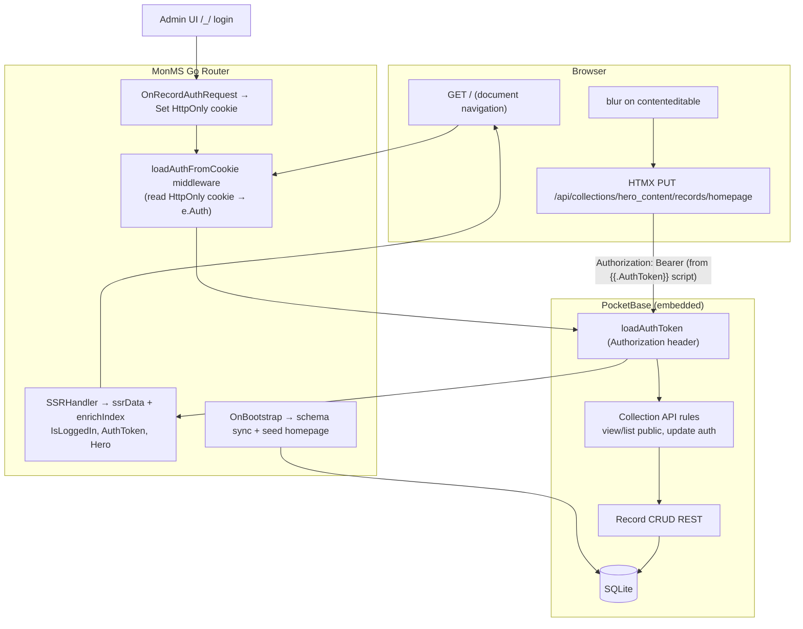

# Phase 3: Inline Contextual Editing & Demonstration Content - Research

**Researched:** 2026-05-22
**Domain:** PocketBase v0.38 auth/API rules, Go SSR template enrichment, HTMX 1.9.12 blur-save, schema bootstrap + record seeding, integration test auth harness
**Confidence:** HIGH (codebase + PocketBase module verified); MEDIUM on browser session bridge (requires MonMS cookie middleware not yet in repo)

---

<user_constraints>
## User Constraints (from CONTEXT.md)

### Locked Decisions

#### Auth Session & Template Context
- **D-50:** `IsLoggedIn` remains `e.Auth != nil` in `ssrData` (already wired in `internal/router/ssr.go`) — no alternate cookie-parsing path in templates.
- **D-51:** Pass `AuthToken` string in SSR data **only when** `IsLoggedIn` is true — value from `e.Auth.Token()` (or equivalent PocketBase auth record token accessor). Empty/absent when logged out. Used for HTMX Authorization header injection; never expose full user object to templates beyond existing `User` key.
- **D-52:** Resolve ICE-05 vs SEC-04 by **server-side token injection**: inline script sets `htmx:configRequest` Bearer header from a Go-rendered `{{.AuthToken}}` variable — **do not** read `pb_auth` from `document.cookie` in JavaScript (HttpOnly cookie stays inaccessible to JS per SEC-04). ICE-05 satisfied because HTMX requests still carry `Authorization: Bearer <token>`.
- **D-53:** Login path for human editors documented as PocketBase admin at `/_/` (not a custom `/admin/login` route). `EDITING-GUIDE.md` walkthrough uses admin UI login → navigate to `/` → edit inline.

#### Editor Overlay & Badge UX
- **D-54:** Replace Phase 1 hidden `#editor-overlay` placeholder with `{{if .IsLoggedIn}}` block rendering `.editor-badge` markup per `01-UI-SPEC.md` (fixed top-right, pulsing dot, "Live Editor Active", link to `/_/` labeled "Full Admin Dashboard").
- **D-55:** When logged out, omit editor overlay from DOM entirely (no hidden placeholder) — satisfies ICE-06 visually and keeps DOM clean for public visitors.
- **D-56:** Reuse existing `main.css` classes `.editor-badge`, `.editor-badge__dot`, `.editor-badge__link` — no new design system; match indigo badge spec from UI-SPEC.

#### Hero Content Data & Seeding
- **D-57:** Add `workspace/schema/hero_content.json` declarative collection (`title` text, `body` text) imported via existing `RegisterBootstrapHook` / D-32 sync — same pattern as `press_releases.json`.
- **D-58:** Seed one record with **fixed id** `homepage` (matches PRD `FindRecordById` / HTMX PUT URL). Idempotent bootstrap seed in Go: after schema import, if `hero_content` collection exists and no `homepage` record, create it with default title/body copy from UI-SPEC hero stub.
- **D-59:** Do **not** expose `core.App` to templates via `.App` — load homepage record in Go SSR handler (index slug only) and pass `Hero` map `{"Title": ..., "Body": ..., "ID": "homepage"}` in template data. Safer, testable, matches current `ssrData` pattern.
- **D-60:** Index route (`/` / empty slug) requires hero record — if missing after seed failure, render index with fallback static copy and `log/slog` warning (no 500 panic).

#### PocketBase API Rules (SEC-02)
- **D-61:** `hero_content` collection rules in schema JSON: **public read** (`listRule`/`viewRule` empty or `""`), **authenticated update only** (`updateRule`: `@request.auth.id != ""`), **create/delete** restricted to admin (`createRule`/`deleteRule`: `@request.auth.id != ""` or admin-only equivalent). Unauthenticated PUT returns 403/401 at API layer.
- **D-62:** No custom Go middleware for PUT auth in Phase 3 — rely on PocketBase collection rules + Bearer header from D-52.

#### Inline Edit Markup & HTMX Save
- **D-63:** `contenteditable`, `hx-put`, `hx-trigger="blur"`, and `hx-vals` attributes render **only inside** `{{if .IsLoggedIn}}` blocks on title and body elements — unauthenticated HTML must not contain those strings (ICE-03, ICE-06). Integration test asserts absence.
- **D-64:** HTMX PUT targets: `/api/collections/hero_content/records/homepage` for both fields (PRD canonical URL).
- **D-65:** Field payload via `hx-vals='js:{"title": event.target.innerText}'` and `hx-vals='js:{"body": event.target.innerText}'` respectively — partial field update on blur, no full-record replace.
- **D-66:** Title field uses `hx-ext="json-enc"` per PRD; body field uses standard `hx-vals` (no json-enc required for single text field).
- **D-67:** HTMX 1.9.12 CDN version unchanged from Phase 1 (D-24 / UI-SPEC) — no version bump in Phase 3.

#### Index Template & Scaffold
- **D-68:** Update `internal/scaffold/embed/index.gohtml` and post-init workspace `templates/index.gohtml` to render `{{.Hero.Title}}` / `{{.Hero.Body}}` with inline-edit attributes when logged in; retain site header + Alpine mobile nav from Phase 1 stub.
- **D-69:** Update `internal/scaffold/embed/base.gohtml` with live editor badge + auth script blocks (uncomment Phase 3 sections); `monms init` skip-if-exists behavior unchanged — operators with existing workspace may need manual merge or re-init guidance in EDITING-GUIDE.
- **D-70:** Add `workspace/EDITING-GUIDE.md` (not embedded in binary) documenting: login at `/_/`, verify badge, edit title/body on `/`, blur-save behavior, logout verification (no contenteditable), troubleshooting failed saves (401 → re-login).

#### Verification & Testing
- **D-71:** Integration tests in `internal/router/`: (1) unauthenticated GET `/` has no `contenteditable` in body; (2) authenticated admin session GET `/` includes `contenteditable` and `Live Editor Active`; (3) unauthenticated PUT to hero_content record returns non-2xx (SEC-02).
- **D-72:** Use existing `testutil` workspace + `startTestServer` pattern from Phase 2 press_releases test; create admin user + auth cookie in test harness for authenticated cases.

### Claude's Discretion
- Exact PocketBase schema JSON rule string syntax if import rejects shorthand — verify against PocketBase v0.22+ collection import format.
- Bootstrap seed implementation file placement (`internal/schema/seed.go` vs extended bootstrap hook).
- Whether to pass `Hero` on non-index routes (default: omit; only index handler enriches data).
- HTMX error feedback UX (toast vs silent fail) — minimal: rely on browser network tab; optional `hx-on::after-request` logging deferred.
- Default seed copy text for homepage record.

### Deferred Ideas (OUT OF SCOPE)
- **Automatic git commits on human inline edits** — PRD NFR §7.2 mentions; belongs to Phase 3 inline editing workflow
- **RICH-01 Markdown in contenteditable** — v2 backlog
- **RICH-02 Image drag-and-drop upload** — v2 backlog
- **Custom `/admin/login` route** — use PocketBase `/_/` only
- **Toast/inline save confirmation UI** — nice-to-have; not required for ICE acceptance
- **Passing `core.App` into templates** — rejected in favor of handler-loaded `Hero` map (D-59)

</user_constraints>

<phase_requirements>
## Phase Requirements

| ID | Description | Research Support |
|----|-------------|------------------|
| ICE-01 | Floating "Live Editor Active" badge with admin dashboard link | D-54–D-56; `.editor-badge*` in `main.css`; conditional `{{if .IsLoggedIn}}` in `base.gohtml` |
| ICE-02 | `IsLoggedIn` set when PocketBase session present | D-50; `e.Auth != nil` in `ssr.go` — requires auth token on SSR GET (see Auth Bridge pattern) |
| ICE-03 | Conditional `contenteditable` when `.IsLoggedIn` | D-63; `index.gohtml` attribute blocks inside `{{if .IsLoggedIn}}` |
| ICE-04 | HTMX PUT on blur to PocketBase REST | D-64–D-66; `hx-put` + `hx-trigger="blur"` + partial `hx-vals` |
| ICE-05 | HTMX includes Authorization Bearer token | D-52; server-rendered `{{.AuthToken}}` in `htmx:configRequest` script |
| ICE-06 | Unauthenticated users see no `contenteditable` | D-55, D-63; integration test string absence on GET `/` |
| SEC-02 | Unauthenticated PUT rejected at database layer | D-61–D-62; `updateRule` + integration PUT without auth |
| SEC-04 | HttpOnly cookie; not accessible from JS | D-52 forbids JS cookie read; MonMS should set HttpOnly cookie on auth (Auth Bridge) |
| DEMO-01 | `hero_content` collection + seeded `homepage` record | D-57–D-58; schema JSON + bootstrap seed via `FindRecordById` / `Save` |
| DEMO-02 | `index.gohtml` renders hero with inline edit when authenticated | D-59, D-68; handler `Hero` map + template markup |
| DEMO-03 | `base.gohtml` global HTMX/Alpine + editor overlay | Phase 1 complete; Phase 3 activates badge + auth script |
</phase_requirements>

---

## Summary

Phase 3 activates the Phase 1 scaffold’s deferred inline-editing surface: authenticated superusers see a live-editor badge, `contenteditable` hero fields backed by a `hero_content` PocketBase collection, and blur-triggered HTMX PUTs to `/api/collections/hero_content/records/homepage`. Implementation spans four areas: (1) `workspace/schema/hero_content.json` with API rules and bootstrap record seeding in `internal/schema/`, (2) SSR enrichment in `internal/router/ssr.go` for `AuthToken`, `Hero`, and index-only handler logic, (3) template/scaffold updates per `03-UI-SPEC.md` and PRD §5 (adapted for D-52), and (4) integration tests extending the Phase 2 `startTestServer` harness.

MonMS embeds **PocketBase v0.38.1** [VERIFIED: go.mod]. Auth is **stateless**: `loadAuthToken` middleware populates `e.Auth` only from the `Authorization` header (Bearer prefix optional) [VERIFIED: pocketbase/apis/middlewares.go]. The admin UI stores tokens in **localStorage** under key `pb_auth`, not HttpOnly cookies [VERIFIED: pocketbase UI pocketbase.es bundle]. Therefore **`e.Auth != nil` on browser GET `/` after admin login at `/_/` will not work unless MonMS adds an auth bridge** (HttpOnly cookie set on login + middleware that loads `e.Auth` from that cookie before SSR). This is the highest-risk gap for ICE-02 and the human UX flow; tests can use `Authorization` headers directly (D-72).

**Auth token for templates:** `e.Auth` is `*core.Record`; there is no `Token()` method. Use `e.Auth.NewAuthToken()` when `e.Auth != nil` [VERIFIED: core/record_tokens.go]. Planner should treat CONTEXT D-51’s `e.Auth.Token()` as meaning `NewAuthToken()`.

**Primary recommendation:** Add `internal/schema/seed.go` (or extend bootstrap hook) for idempotent `homepage` record; add `internal/router/auth.go` for cookie bridge + `enrichSSRData`; ship `hero_content.json` with `listRule`/`viewRule` `""` and `updateRule` `@request.auth.id != ""`; extend `base.gohtml` with `json-enc` extension script; integration tests in `internal/router/inline_edit_test.go`.

## Architectural Responsibility Map

| Capability | Primary Tier | Secondary Tier | Rationale |
|------------|-------------|----------------|-----------|
| `IsLoggedIn` / `AuthToken` in SSR | Frontend Server (SSR / Go router) | API / Backend (PocketBase auth middleware) | `ssrData` in `internal/router/ssr.go`; `e.Auth` from PocketBase request pipeline |
| Auth session bridge (cookie → `e.Auth`) | API / Backend (MonMS hook + middleware) | — | PocketBase default does not send auth on document navigation; MonMS must bridge |
| Live editor badge + HTMX auth script | Frontend Server (templates) | Browser (HTMX/Alpine) | `base.gohtml` SSR; HTMX runs in browser |
| Inline blur-save PUT | Browser (HTMX) | API / Backend (PocketBase REST) | HTMX calls `/api/collections/...`; rules enforce auth |
| `hero_content` schema + rules | Database / Storage (SQLite via PocketBase) | API / Backend (bootstrap import) | `workspace/schema/*.json` → `ImportCollectionsByMarshaledJSON` |
| Homepage record seed | API / Backend (bootstrap hook) | Database / Storage | Go `FindRecordById` + `Save` after import |
| Hero field load for index | Frontend Server (SSR handler) | Database / Storage | Handler reads record; passes `Hero` map (D-59) |
| Collection PUT authorization | API / Backend (PocketBase rules) | — | D-62: no custom Go PUT middleware |
| Integration tests | API / Backend (Go test) | — | `httptest` + embedded PocketBase |

---

## Standard Stack

### Core (no new Go modules)

| Library | Version | Purpose | Why Standard |
|---------|---------|---------|--------------|
| `github.com/pocketbase/pocketbase` | **v0.38.1** | Embedded DB, REST API, auth, collection rules | Already in go.mod; MonMS runtime [VERIFIED: go.mod] |
| HTMX | **1.9.12** | Blur-triggered PUT | Locked D-67; CDN in `base.gohtml` [VERIFIED: scaffold embed] |
| HTMX `json-enc` extension | **1.9.12** (same CDN host) | JSON body for title PUT (D-66) | Required for `hx-ext="json-enc"` [VERIFIED: unpkg.com/htmx.org@1.9.12/dist/ext/json-enc.js] |
| Alpine.js | **3.14.8** | Mobile nav only | Unchanged Phase 1 |
| Tailwind Play CDN | v3 | Utilities + preflight | Unchanged Phase 1 |
| `html/template` (stdlib) | — | SSR | Existing `ssr.go` path |
| `log/slog` (stdlib) | — | Seed failure warnings (D-60) | Phase 1 pattern |

### PocketBase APIs (use these, do not reimplement)

| API | Purpose |
|-----|---------|
| `e.Auth != nil` | `IsLoggedIn` (D-50) |
| `(*Record).NewAuthToken()` | SSR `AuthToken` for HTMX (D-51) |
| `app.FindRecordById("hero_content", "homepage")` | Hero load in handler (D-59) |
| `app.ImportCollectionsByMarshaledJSON` | Schema sync (existing `sync.go`) |
| `core.NewRecord` + `record.Set("id", "homepage")` + `app.Save` | Idempotent seed (D-58) |
| Collection `listRule`/`viewRule`/`updateRule` in JSON | SEC-02 (D-61) |

**Installation:** None — zero new `go get` for Phase 3.

---

## Architecture Patterns

### System Architecture Diagram



### Recommended File Changes

```
workspace/schema/hero_content.json     # collection + rules (D-57, D-61)
internal/schema/seed.go                # idempotent homepage record (D-58) — discretion
internal/schema/sync.go                # call seed after ImportCollections
internal/router/auth.go                # cookie bridge + AuthToken helper — NEW
internal/router/ssr.go                 # enrichSSRData, index Hero load (D-59)
internal/router/inline_edit_test.go    # ICE/SEC integration tests (D-71)
internal/scaffold/embed/base.gohtml    # badge, auth script, json-enc (D-54, D-52)
internal/scaffold/embed/index.gohtml   # hero + inline attrs (D-68)
workspace/EDITING-GUIDE.md             # manual walkthrough (D-70)
```

### Pattern 1: PocketBase API rules in schema JSON

**What:** Declare `listRule`, `viewRule`, `createRule`, `updateRule`, `deleteRule` in collection import JSON.

**Rule semantics** [CITED: pocketbase.io/docs/api-rules-and-filters]:
- `null` — superuser only (locked)
- `""` — public access
- `"@request.auth.id != ''"` — authenticated users only

**Recommended `hero_content.json`:**

```json
{
  "name": "hero_content",
  "type": "base",
  "listRule": "",
  "viewRule": "",
  "createRule": "@request.auth.id != ''",
  "updateRule": "@request.auth.id != ''",
  "deleteRule": "@request.auth.id != ''",
  "fields": [
    {"name": "title", "type": "text"},
    {"name": "body", "type": "text"}
  ]
}
```

Superusers bypass all rules [CITED: pocketbase.io/docs/api-rules-and-filters]. Human editors logging in via `/_/` are `_superusers` — they can update even if rules are stricter, but SEC-02 test targets **guest PUT → 403**.

### Pattern 2: Idempotent bootstrap record seed

**What:** After `ImportCollectionsByMarshaledJSON`, ensure `homepage` exists.

**When:** Every bootstrap (same hook as D-32).

**Example:**

```go
// Source: [CITED: pocketbase.io/docs/go-records], [VERIFIED: core/record_model_test.go Set("id")]
func seedHeroHomepage(app core.App) error {
    coll, err := app.FindCollectionByNameOrId("hero_content")
    if err != nil {
        return nil // collection not imported yet
    }
    if _, err := app.FindRecordById("hero_content", "homepage"); err == nil {
        return nil // already seeded
    }
    record := core.NewRecord(coll)
    record.Set("id", "homepage")
    record.Set("title", "Welcome to MonMS")
    record.Set("body", "This headline and paragraph are stored in the hero_content collection...")
    return app.Save(record)
}
```

Call from `RegisterBootstrapHook` after successful import. Log and continue on failure (D-60 uses fallback copy in handler).

### Pattern 3: SSR data enrichment (index only)

**What:** Extend `ssrData` or wrap SSR handler for empty slug / `index`.

```go
// Source: [VERIFIED: internal/router/ssr.go]
func enrichSSRData(e *core.RequestEvent, slug string, app core.App) map[string]any {
    data := ssrData(e, slug)
    if e.Auth != nil {
        if token, err := e.Auth.NewAuthToken(); err == nil {
            data["AuthToken"] = token
        }
    }
    if slug == "" || slug == "index" {
        data["Hero"] = loadHero(app) // map with Title, Body, ID; fallback on error
    }
    return data
}
```

Do not pass `Hero` on other slugs (CONTEXT discretion default).

### Pattern 4: Server-injected HTMX Bearer (D-52)

**What:** Script block only when logged in; never parse `document.cookie`.

```gohtml
{{if .IsLoggedIn}}
<script src="https://unpkg.com/htmx.org@1.9.12/dist/ext/json-enc.js"></script>
<script>
  document.body.addEventListener('htmx:configRequest', function (event) {
    event.detail.headers['Authorization'] = 'Bearer {{.AuthToken}}';
  });
</script>
{{end}}
```

Place before Alpine defer script [03-UI-SPEC.md]. Ensure `AuthToken` is HTML-safe (JWT is alphanumeric-safe; use template context as-is).

### Pattern 5: Index inline edit markup

```gohtml
<h1 class="hero__title{{if .IsLoggedIn}} hero__title--editable{{end}}"
  {{if .IsLoggedIn}}
  contenteditable="true"
  hx-put="/api/collections/hero_content/records/homepage"
  hx-trigger="blur"
  hx-ext="json-enc"
  hx-vals='js:{"title": event.target.innerText}'
  {{end}}>{{.Hero.Title}}</h1>

<p class="hero__body{{if .IsLoggedIn}} hero__body--editable{{end}}"
  {{if .IsLoggedIn}}
  contenteditable="true"
  hx-put="/api/collections/hero_content/records/homepage"
  hx-trigger="blur"
  hx-vals='js:{"body": event.target.innerText}'
  {{end}}>{{.Hero.Body}}</p>
```

### Pattern 6: Auth bridge for browser sessions (ICE-02) — **required for real UX**

**Problem:** PocketBase v0.38 loads auth only from `Authorization` header [VERIFIED: apis/middlewares.go `getAuthTokenFromRequest`]. Admin UI persists token in **localStorage** (`pb_auth`), not cookies [VERIFIED: pocketbase.es bundle]. Navigating from `/_/` to `/` sends no auth header → `IsLoggedIn` false.

**What:** MonMS sets HttpOnly cookie on successful auth; middleware reads it before SSR.

```go
// OnRecordAuthRequest — after successful auth
e.SetCookie(&http.Cookie{
    Name:     "pb_auth", // or monms_auth
    Value:    e.Token,    // from RecordAuthRequestEvent
    Path:     "/",
    HttpOnly: true,
    Secure:   e.IsTLS(),
    SameSite: http.SameSiteLaxMode,
})

// Before SSR — custom middleware on MonMS routes
func loadAuthFromCookie(e *core.RequestEvent) error {
    if e.Auth != nil {
        return e.Next()
    }
    c, err := e.Request.Cookie("pb_auth")
    if err != nil || c.Value == "" {
        return e.Next()
    }
    record, err := e.App.FindAuthRecordByToken(c.Value, core.TokenTypeAuth)
    if err == nil && record != nil {
        e.Auth = record
    }
    return e.Next()
}
```

Bind on `OnServe()` before `RegisterRoutes`, or wrap SSR/fragment handlers. Logout: clear cookie when admin calls auth refresh clear / document in EDITING-GUIDE.

**SEC-04 alignment:** HttpOnly cookie holds JWT; JS never reads it (D-52); HTMX uses server-rendered token in page HTML.

### Anti-Patterns to Avoid

- **Reading `pb_auth` from `document.cookie` in templates** — violates D-52/SEC-04.
- **Exposing `core.App` in templates** — rejected D-59; breaks testability.
- **Hand-rolling PUT auth middleware** — D-62; use collection rules.
- **Using `e.Auth.Token()`** — method does not exist on `*Record`; use `NewAuthToken()`.
- **Leaving hidden `#editor-overlay` when logged out** — violates D-55/ICE-06.
- **Full-record PUT on blur** — use partial `hx-vals` per D-65.

---

## Don't Hand-Roll

| Problem | Don't Build | Use Instead | Why |
|---------|-------------|-------------|-----|
| JWT generation | Custom HS256 signing | `record.NewAuthToken()` | PocketBase signing keys, refresh semantics |
| Auth record lookup | Parse JWT manually | `app.FindAuthRecordByToken` | Handles collection + expiry |
| Collection CRUD rules | Go middleware per route | Schema `*Rule` fields | SEC-02 at DB layer (D-62) |
| Schema import | Custom SQL migrations | `ImportCollectionsByMarshaledJSON` | Matches Phase 1–2 dual-write |
| Inline save transport | fetch/XHR boilerplate | HTMX `hx-put` + `blur` | PRD canonical; less JS |

---

## Common Pitfalls

### Pitfall 1: `IsLoggedIn` false after admin login (auth bridge missing)

**What goes wrong:** User logs in at `/_/`, visits `/`, no badge and no `contenteditable`.

**Why:** PocketBase admin uses localStorage; SSR GET has no `Authorization` header.

**How to avoid:** Implement Pattern 6 (cookie set on auth + cookie loader middleware).

**Warning signs:** Manual test fails while integration test with `Authorization` header passes.

### Pitfall 2: `e.Auth.Token()` does not compile

**What goes wrong:** Planner copies CONTEXT literally.

**Why:** PocketBase v0.38 `*Record` exposes `NewAuthToken()`, not `Token()`.

**How to avoid:** `token, err := e.Auth.NewAuthToken()`.

### Pitfall 3: `json-enc` extension not loaded

**What goes wrong:** Title PUT sends form body; PocketBase returns 400.

**Why:** `hx-ext="json-enc"` requires separate script.

**How to avoid:** Add `<script src="https://unpkg.com/htmx.org@1.9.12/dist/ext/json-enc.js"></script>` in `base.gohtml` head or before auth script.

### Pitfall 4: API rules use `null` instead of `""` for public read

**What goes wrong:** Public GET of hero record returns 403; index fallback always shown.

**Why:** `null` means superuser-only in PocketBase rules.

**How to avoid:** Use `""` for `listRule` and `viewRule` (D-61).

### Pitfall 5: Integration test expects cookie but only sets header

**What goes wrong:** Test flakiness depending on bridge implementation.

**How to avoid:** Tests use `Authorization: Bearer <token>` on `http.Client` for authenticated GET; separate test for cookie bridge once implemented. Create superuser via `core.NewRecord` on `_superusers` + `Save`, then `NewAuthToken()` [VERIFIED: apis batch_test superuser POST pattern].

### Pitfall 6: `contenteditable` in HTML when logged out

**What goes wrong:** ICE-06 failure; security surface exposed.

**Why:** Attributes outside `{{if .IsLoggedIn}}` or string leaked in comments.

**How to avoid:** Wrap full attribute list; test with `strings.Contains(body, "contenteditable")` on unauth GET.

### Pitfall 7: Seed runs before collection import

**What goes wrong:** `FindCollectionByNameOrId` fails; no homepage record.

**How to avoid:** Seed only after `ImportCollectionsByMarshaledJSON` succeeds in bootstrap hook.

### Pitfall 8: Re-init workspaces keep stale templates

**What goes wrong:** Operators miss badge/hero markup.

**Why:** `monms init` skip-if-exists (D-69).

**How to avoid:** Document manual merge in `EDITING-GUIDE.md`.

---

## Code Examples

### Authenticated integration test client

```go
// Source: [VERIFIED: internal/router/handlers_test.go startTestServer pattern]
func authClient(t *testing.T, ts *httptest.Server, app core.App) *http.Client {
    t.Helper()
    coll, err := app.FindCollectionByNameOrId(core.CollectionNameSuperusers)
    if err != nil {
        t.Fatalf("superusers collection: %v", err)
    }
    rec := core.NewRecord(coll)
    rec.Set("email", "inline@test.local")
    rec.Set("password", "1234567890")
    rec.Set("passwordConfirm", "1234567890")
    if err := app.Save(rec); err != nil {
        t.Fatalf("create superuser: %v", err)
    }
    token, err := rec.NewAuthToken()
    if err != nil {
        t.Fatalf("auth token: %v", err)
    }
    return &http.Client{
        Transport: &authTransport{base: http.DefaultTransport, token: token},
        Timeout:   10 * time.Second,
    }
}

type authTransport struct {
    base  http.RoundTripper
    token string
}

func (t *authTransport) RoundTrip(req *http.Request) (*http.Response, error) {
    req = req.Clone(req.Context())
    req.Header.Set("Authorization", "Bearer "+t.token)
    return t.base.RoundTrip(req)
}
```

### SEC-02 unauthenticated PUT test

```go
req, _ := http.NewRequest(http.MethodPut,
    ts.URL+"/api/collections/hero_content/records/homepage",
    strings.NewReader(`{"title":"Hacked"}`))
req.Header.Set("Content-Type", "application/json")
resp, err := http.DefaultClient.Do(req)
// expect 401 or 403
```

### Unauthenticated GET must omit edit surface

```go
resp, err := http.Get(ts.URL + "/")
body, _ := io.ReadAll(resp.Body)
if strings.Contains(string(body), "contenteditable") {
    t.Fatal("unauthenticated page must not contain contenteditable")
}
```

---

## State of the Art

| Old Approach (PRD / ROADMAP) | Current Approach (Phase 3 CONTEXT) | Impact |
|------------------------------|-------------------------------------|--------|
| Parse `pb_auth` from `document.cookie` in JS | Server-rendered `{{.AuthToken}}` in `htmx:configRequest` | SEC-04 + ICE-05 satisfied without JS cookie access |
| `.App.FindRecordById` in template | Handler-loaded `Hero` map | D-59; safer templates |
| `e.Auth.Token()` (naming) | `e.Auth.NewAuthToken()` | PocketBase v0.38 API |
| PocketBase session cookie auto on SSR | Header-only auth + MonMS cookie bridge | Must implement for ICE-02 browser flow |

**Deprecated/outdated:**
- PRD HTMX 1.9.10 — project pins **1.9.12** (D-67).
- PRD inline Tailwind `text-4xl` on hero — **03-UI-SPEC** keeps `.hero__title` / `.hero__body` classes.

---

## Assumptions Log

| # | Claim | Section | Risk if Wrong |
|---|-------|---------|---------------|
| A1 | `AuthToken` comes from `e.Auth.NewAuthToken()`, not `Token()` | Pattern 3 | Compile failure |
| A2 | MonMS must implement HttpOnly cookie auth bridge for browser ICE-02 | Pattern 6 | Login → edit flow broken in manual UAT |
| A3 | `""` in JSON import sets public list/view rules | Pattern 1 | Import may coerce; verify in integration test |
| A4 | Superuser token satisfies authenticated PUT tests | SEC-02 test design | Non-super auth collection may need separate fixture |
| A5 | `json-enc` CDN path valid for 1.9.12 | Standard Stack | Title save fails |

---

## Open Questions

1. **Cookie name and logout clearing**
   - What we know: Admin SDK uses `pb_auth` as localStorage key; HttpOnly cookie name not standardized in PocketBase Go.
   - What's unclear: Reuse `pb_auth` cookie name vs `monms_auth` to avoid clashing with localStorage key semantics.
   - Recommendation: Use `monms_auth` HttpOnly cookie set by MonMS hook; document clearing on logout in EDITING-GUIDE.

2. **Whether auth bridge is in Phase 3 scope or implicit**
   - What we know: D-50/D-72 assume working authenticated GET; ROADMAP mentions session cookie.
   - What's unclear: CONTEXT does not explicitly list cookie middleware task.
   - Recommendation: Planner includes auth bridge as Wave 0/1 task — without it ICE-02 fails manual UAT.

3. **Exact non-2xx status for guest PUT**
   - What we know: PocketBase returns 401/403 depending on rule and route.
   - Recommendation: Test `resp.StatusCode >= 400` (D-71).

---

## Environment Availability

| Dependency | Required By | Available | Version | Fallback |
|------------|------------|-----------|---------|----------|
| Go | Build, tests | ✓ | 1.25.6 | — |
| PocketBase (module) | Runtime | ✓ | v0.38.1 | — |
| Node/npx | Context7 CLI docs | ✓ | — | WebFetch docs |
| Network (CDN) | HTMX/Tailwind in templates | ✓ | — | Tests still pass without CDN fetch |
| git | Workspace | ✓ | — | — |

**Missing dependencies with no fallback:** None identified.

---

## Validation Architecture

### Test Framework

| Property | Value |
|----------|-------|
| Framework | Go `testing` + `net/http/httptest` |
| Config file | none — convention in `internal/router/*_test.go` |
| Quick run command | `go test ./internal/router/ -run 'TestInline|TestHero|TestUnauth' -count=1` |
| Full suite command | `go test ./... -count=1` |

### Phase Requirements → Test Map

| Req ID | Behavior | Test Type | Automated Command | File Exists? |
|--------|----------|-----------|-------------------|-------------|
| ICE-01 | Badge when logged in | integration | `go test ./internal/router/ -run TestInlineEdit_AuthenticatedShowsBadge -count=1` | ❌ Wave 0 |
| ICE-02 | `IsLoggedIn` drives template | integration | `go test ./internal/router/ -run TestInlineEdit_AuthenticatedShowsBadge -count=1` | ❌ Wave 0 |
| ICE-03 | Conditional contenteditable | integration | `go test ./internal/router/ -run TestInlineEdit_AuthenticatedShowsContenteditable -count=1` | ❌ Wave 0 |
| ICE-04 | HTMX PUT path exists in HTML | integration | substring `hx-put="/api/collections/hero_content/records/homepage"` | ❌ Wave 0 |
| ICE-05 | Bearer script present when auth | integration | substring `Authorization` + `Bearer` in authed body | ❌ Wave 0 |
| ICE-06 | No contenteditable when guest | integration | `go test ./internal/router/ -run TestInlineEdit_UnauthenticatedHidesEdit -count=1` | ❌ Wave 0 |
| SEC-02 | Guest PUT rejected | integration | `go test ./internal/router/ -run TestHeroContent_GuestPutForbidden -count=1` | ❌ Wave 0 |
| SEC-04 | No `document.cookie` / pb_auth parse in HTML | integration | `NotContains(body, "document.cookie")` | ❌ Wave 0 |
| DEMO-01 | Collection + homepage seed | integration | bootstrap + `FindRecordById` or GET `/` contains seed title | ❌ Wave 0 |
| DEMO-02 | Index renders hero | integration | GET `/` contains seed copy | ❌ Wave 0 |
| DEMO-03 | base has HTMX/Alpine | integration | existing scaffold tests / Phase 1 | ✅ partial |

### Sampling Rate

- **Per task commit:** `go test ./internal/router/ -run 'TestInline|TestHero' -count=1`
- **Per wave merge:** `go test ./internal/... -count=1`
- **Phase gate:** Full suite green before `/gsd-verify-work`

### Wave 0 Gaps

- [ ] `internal/router/inline_edit_test.go` — ICE-01 through ICE-06, SEC-02, SEC-04
- [ ] `internal/testutil/auth.go` (optional) — superuser + Bearer client helper
- [ ] `workspace/schema/hero_content.json` fixture in tests
- [ ] Auth cookie bridge implementation before cookie-specific test (or test header-only first)

---

## Security Domain

### Applicable ASVS Categories

| ASVS Category | Applies | Standard Control |
|---------------|---------|-----------------|
| V2 Authentication | yes | PocketBase superuser auth; MonMS cookie bridge; Bearer on HTMX |
| V3 Session Management | yes | Stateless JWT; HttpOnly cookie for SSR only |
| V4 Access Control | yes | Collection `updateRule`; superuser bypass documented |
| V5 Input Validation | yes | PocketBase field validators on `title`/`body` text fields |
| V6 Cryptography | yes | `NewAuthToken()` — never hand-roll JWT |

### Known Threat Patterns

| Pattern | STRIDE | Standard Mitigation |
|---------|--------|---------------------|
| Unauthenticated content tampering | Tampering | `updateRule: "@request.auth.id != ''"` (D-61) |
| XSS via injected token in script | Tampering / Info | Go html/template auto-escaping; JWT charset |
| CSRF on state-changing PUT | Tampering | SameSite=Lax cookie; CORS default; HTMX same-origin |
| Privilege escalation via create/delete | Elevation | `createRule`/`deleteRule` require auth |
| Token theft via JS | Info disclosure | HttpOnly cookie (bridge); D-52 no JS cookie read |

---

## Sources

### Primary (HIGH confidence)

- [VERIFIED: go.mod] — `github.com/pocketbase/pocketbase v0.38.1`
- [VERIFIED: internal/router/ssr.go] — `IsLoggedIn`, `ssrData`
- [VERIFIED: internal/schema/sync.go] — bootstrap import
- [VERIFIED: workspace/schema/press_releases.json] — schema JSON shape
- [VERIFIED: pocketbase@v0.38.1/apis/middlewares.go] — `loadAuthToken`, Bearer parsing
- [VERIFIED: pocketbase@v0.38.1/core/record_tokens.go] — `NewAuthToken()`
- [VERIFIED: pocketbase@v0.38.1/core/collection_model.go] — rule field types
- [CITED: pocketbase.io/docs/api-rules-and-filters] — `null` vs `""` vs expression
- [CITED: pocketbase.io/docs/authentication] — stateless Authorization header
- [CITED: pocketbase.io/docs/go-records] — create/save records, custom id
- [VERIFIED: unpkg.com/htmx.org@1.9.12/dist/ext/json-enc.js] — json-enc extension

### Secondary (MEDIUM confidence)

- [CITED: specs/monms-prd.md §5] — markup reference (adapted per D-52/D-59)
- `.planning/phases/03-inline-contextual-editing-demonstration-content/03-UI-SPEC.md` — copy, CSS, interaction contract
- `.planning/phases/02-agent-mutation-engine-safety-guardrails/02-RESEARCH.md` — test harness patterns

### Tertiary (LOW confidence)

- None retained without verification

---

## Metadata

**Confidence breakdown:**
- Standard stack: HIGH — pinned versions in repo and module cache
- Architecture: MEDIUM — auth bridge inferred from PB v0.38 behavior vs ROADMAP cookie wording
- Pitfalls: HIGH — verified against PocketBase source and existing MonMS code

**Research date:** 2026-05-22
**Valid until:** 2026-06-22 (30 days; PocketBase 0.38.x stable)

---

## RESEARCH COMPLETE

**Phase:** 3 - Inline Contextual Editing & Demonstration Content
**Confidence:** HIGH (implementation patterns); MEDIUM (auth bridge scope confirmation)

### Key Findings

- PocketBase **v0.38.1** uses **Authorization-header-only** auth; admin UI stores tokens in **localStorage**, not HttpOnly cookies — MonMS needs a **cookie bridge** for ICE-02 browser UX.
- Use **`e.Auth.NewAuthToken()`** for `AuthToken` (no `Token()` on `*Record`).
- Collection rules: **`""` = public**, **`null` = superuser-only**; recommended `hero_content.json` included above.
- Idempotent seed: **`record.Set("id", "homepage")`** then `app.Save` after schema import.
- HTMX title field needs **`json-enc` extension script** from unpkg 1.9.12.
- Integration tests should use **Bearer header transport**; assert **no `contenteditable`** for guests and **403/401 on guest PUT**.

### File Created

`.planning/phases/03-inline-contextual-editing-demonstration-content/03-RESEARCH.md`

### Ready for Planning

Research complete. Planner can create PLAN.md with auth bridge as an explicit early task.
