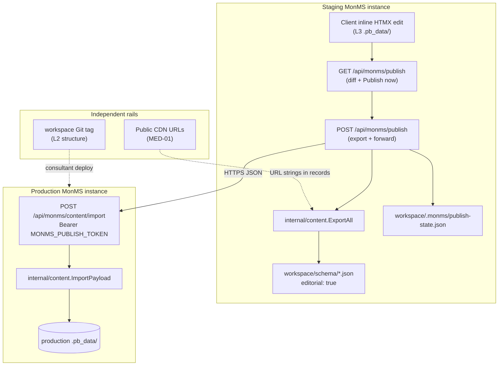

# Phase 4: Staging Environments & Client Content Publish - Research

**Researched:** 2026-05-23
**Domain:** PocketBase v0.38.1 Go record export/import, custom API routes, MonMS CLI subcommands, staging/production content rail
**Confidence:** HIGH (codebase + PocketBase docs verified); MEDIUM on admin UI path and publisher role model (PocketBase has no native “Publisher” role — MonMS must implement gating)

<user_constraints>
## User Constraints (from CONTEXT.md)

### Locked Decisions

- **D-50:** Four layers — engine (L1), structure (L2), content (L3), audience (L4).
- **D-51:** Dual promotion rails — Git tag for structure; JSON upsert for content.
- **D-52:** Staging and production are separate MonMS instances with separate `.pb_data/`.
- **D-53:** Primary publish UX is client **Publish to live** in admin; consultants not in routine content loop.
- **D-54:** Editorial records in `workspace/content/*.json`; upsert by fixed record ID.
- **D-55:** Publishable media = public CDN URLs in content fields; blobs do not move.
- **D-56:** Full `.pb_data/` backup/restore is not the primary publish mechanism.

### Claude's Discretion

*(No explicit discretion section in 04-CONTEXT.md — planner has freedom on: publisher role implementation detail, exact admin page URL if SPA conflicts, checksum file location under workspace, export field filtering for file-type columns, and whether `monms content publish` CLI wraps HTTP or dual bootstrap.)*

### Deferred Ideas (OUT OF SCOPE)

- Whole-database sync between environments
- Consultant required for every content push
- Blob replication staging → production
</user_constraints>

<phase_requirements>
## Phase Requirements

| ID | Description | Research Support |
|----|-------------|------------------|
| ENV-01 | Documentation and tooling distinguish four layers | Extend `README.md`, `workspace/README.md`, `CLAUDE.md` cross-links; optional `monms content` help text references L1–L4 |
| ENV-02 | Structure promotion uses Git tags; content is separate rail | Document in lifecycle guide; no code couples Git to content import |
| ENV-03 | Staging and production are separate instances with separate `.pb_data/` | `DefaultDataDir: {workspace}/.pb_data` per instance (existing D-27); env config for production URL + publish token |
| PUB-01 | Editorial collections marked `"editorial": true` in schema JSON | Parse flag from raw schema JSON in MonMS (not PocketBase Collection model) |
| PUB-02 | `workspace/content/*.json` holds exported editorial records with stable IDs | `internal/content/export.go` writes `{collection, records[]}` per file |
| PUB-03 | `monms content export` writes snapshots to `workspace/content/` | CLI bootstrap pattern + `ExportAll` |
| PUB-04 | `monms content import` upserts idempotently by ID | Mirror `seed.go` FindRecordById → NewRecord → Save |
| PUB-05 | Production exposes `POST /api/monms/content/import` with scoped publish token | Custom route + env `MONMS_PUBLISH_TOKEN` middleware (not superuser) |
| PUB-06 | Staging admin UI includes **Publish to live** with diff preview | Custom HTML page + staging API routes; link from editor badge |
| PUB-07 | Publisher role gates publish; editors edit without publishing | Allowlist or auth-collection role check on publish routes only |
| PUB-08 | Staging tracks last-published checksum | Workspace state file (recommended) |
| PUB-09 | `monms content diff` shows pending changes | Canonical JSON checksum compare current export vs last-publish state |
| MED-01 | Publishable media uses public CDN URLs; no blob copy | Export text/URL fields only; skip or warn on `file` field types |
| MED-02 | Documentation warns against PocketBase-local file storage for publishable assets | `workspace/README.md` + `MEDIA.md` or section in lifecycle doc |
</phase_requirements>

---

## Summary

Phase 4 adds the **content promotion rail** on top of the existing v1 engine: editorial PocketBase records export to `workspace/content/*.json`, upsert to production by fixed record ID via `POST /api/monms/content/import`, and clients trigger publish from a MonMS-hosted admin page linked from the PocketBase admin area. Structure (L2) continues to promote via workspace Git tags independently (D-51).

Implementation centers on a new **`internal/content/`** package: discover editorial collections from schema JSON (`"editorial": true`), export/import/diff using PocketBase Go APIs (`FindAllRecords`, `FindRecordById`, `NewRecord`, `Save`) mirroring `internal/schema/seed.go`, and register MonMS API routes in `OnServe()` alongside existing SSR routes. The **`monms content`** CLI subcommand follows the early-dispatch pattern from `validate` but bootstraps an ephemeral PocketBase app (like `seed_test.go`) because export/import requires SQLite access.

**Critical constraint:** PocketBase `ImportCollectionsByMarshaledJSON` unmarshals schema JSON into `core.Collection` — unknown keys like `"editorial": true` are **stripped** and never appear on the live collection model [VERIFIED: `core/collection_import.go`]. MonMS must parse editorial metadata from **raw schema files** in `loadSchemaJSONFiles` or a parallel `LoadEditorialCollections(wsAbs)` helper.

**Admin UI:** PocketBase admin is a prebuilt SPA served at `/_/{path...}` from `ui.DistDirFS` [VERIFIED: `internal/router/handlers_test.go`]. There is no supported hook to inject a Svelte route into the admin SPA without forking PocketBase UI [CITED: pocketbase.io/docs/go-routing — custom routes render standalone HTML]. Serve the publish console at **`GET /api/monms/publish`** (HTML) or **`GET /_/monms/publish`** registered **before** the static `/_/` catch-all; link from the live-editor badge and document as “Publish to live” in `EDITING-GUIDE.md`.

**Publish token auth:** PocketBase provides `apis.RequireAuth()` and `apis.RequireSuperuserAuth()` [CITED: pocketbase.io/docs/go-routing] — neither matches “scoped to content import only.” Use a **dedicated env token** (`MONMS_PUBLISH_TOKEN`) validated with `crypto/subtle.ConstantTimeCompare` in custom middleware on import (production) and outbound POST from staging.

**Primary recommendation:** Ship `internal/content/` + `monms content {export,import,diff,publish}` + production import API + staging publish HTML/API under `/api/monms/*`; store last-publish checksum in gitignored `workspace/.monms/publish-state.json`; gate publish UI on superuser session plus publisher allowlist in `workspace/.monms/config.json`.

## Architectural Responsibility Map

| Capability | Primary Tier | Secondary Tier | Rationale |
|------------|-------------|----------------|-----------|
| Editorial collection discovery | API / Backend (`internal/schema` + `internal/content`) | Database / Storage | Flag lives in schema JSON files, not PocketBase model |
| Record export/import/diff/upsert | API / Backend (`internal/content`) | Database / Storage (SQLite via PocketBase) | Go `core.App` record APIs — same tier as `seed.go` |
| Production content import API | API / Backend (MonMS custom route) | — | `POST /api/monms/content/import` on production instance |
| Publish token validation | API / Backend (custom middleware) | — | Env-scoped secret; not PocketBase superuser JWT |
| Staging publish UI + diff | API / Backend (HTML/JSON routes) | Browser | Server-rendered or JSON + minimal JS; superuser session for staging |
| Publisher vs editor gating | API / Backend (publish route handler) | — | Check allowlist/role before POST to production |
| Last-publish checksum | Database / Storage (workspace file) | — | Staging-local state in `.monms/publish-state.json` |
| `monms content` CLI | API / Backend (ephemeral bootstrap) | — | Offline DB access without running HTTP server |
| Four-layer documentation | — (docs only) | CDN / Static | README updates; no runtime |
| CDN URL media policy | Database / Storage (text fields) | CDN / Static | URL strings in records; blobs stay on CDN |
| Structure Git tag promotion | — (consultant workflow) | — | Out of Phase 4 code path; document only (ENV-02) |

---

## Standard Stack

### Core (no new Go modules)

| Library | Version | Purpose | Why Standard |
|---------|---------|---------|--------------|
| `github.com/pocketbase/pocketbase` | **v0.38.1** | Embedded DB, record CRUD, custom routes | Already in go.mod [VERIFIED: go.mod] |
| `crypto/sha256`, `crypto/subtle` | stdlib | Checksum + constant-time token compare | No new deps for PUB-08/PUB-05 |
| `encoding/json` | stdlib | Content JSON + canonical diff | Matches schema sync pattern |
| `log/slog` | stdlib | Export/import logging | Project convention [VERIFIED: CLAUDE.md] |

### PocketBase APIs (use these, do not reimplement)

| API | Purpose |
|-----|---------|
| `app.FindAllRecords(collectionName)` | Export all editorial records [CITED: pocketbase.io/docs/go-records] |
| `app.FindRecordById(coll, id)` | Upsert existence check [VERIFIED: seed.go] |
| `core.NewRecord(collection)` + `record.Set(...)` + `app.Save(record)` | Create/update by ID [VERIFIED: seed.go] |
| `record.PublicExport()` / `record.MarshalJSON()` | Safe field serialization for export [VERIFIED: core/record_model.go] |
| `app.FindCollectionByNameOrId(name)` | Resolve collection before upsert |
| `se.Router.POST(...).Bind(middleware)` | Register import route [CITED: pocketbase.io/docs/go-routing] |
| `apis.RequireSuperuserAuth()` | Staging publish **UI** session gate only |
| `e.JSON`, `e.HTML`, `e.BindBody` | Request/response helpers |

**Installation:** None — zero new `go get` for Phase 4.

---

## Architecture Patterns

### System Architecture Diagram



### Recommended Project Structure

```
internal/
├── content/
│   ├── cmd.go           # RunCLI — export|import|diff|publish subcommands
│   ├── schema.go        # LoadEditorialCollections from schema/*.json
│   ├── export.go        # ExportAll, ExportCollection → workspace/content/
│   ├── import.go        # ImportFiles, ImportPayload, UpsertRecord
│   ├── diff.go          # DiffExport vs state or target dir
│   ├── checksum.go      # Canonical JSON + SHA256
│   ├── state.go         # publish-state.json read/write
│   ├── routes.go        # RegisterContentRoutes(app, wsAbs)
│   ├── auth.go          # RequirePublishToken, RequirePublisher
│   ├── publish.go       # HTTP client POST to production
│   ├── export_test.go
│   ├── import_test.go
│   └── routes_test.go
├── schema/
│   ├── sync.go          # (modify) optional hook — no editorial in PB import
│   └── editorial.go     # ParseEditorialFlag from raw JSON — NEW
internal/scaffold/embed/   # (optional) publish link in base.gohtml badge area
main.go                    # early dispatch: content subcommand + RegisterContentRoutes
workspace/
├── content/               # exported JSON (PUB-02) — may commit or gitignore per site
│   └── hero_content.json
├── .monms/
│   ├── config.json        # productionUrl, publisherEmails (gitignored secrets path)
│   └── publish-state.json # last checksum + timestamp (gitignore)
├── schema/
│   └── hero_content.json  # add "editorial": true
└── MEDIA.md               # MED-02 guidance — NEW
specs/staging.md           # already accepted — reference, don't duplicate
```

### Pattern 1: Editorial flag in schema JSON (MonMS-side parse)

**What:** Add `"editorial": true` to collection schema files; parse from raw JSON before/alongside PocketBase import.

**Why:** PocketBase collection import drops unknown JSON keys [VERIFIED: `collection_import.go` unmarshals into `*Collection`].

**Example:**

```go
// internal/schema/editorial.go
type SchemaMeta struct {
    Name      string `json:"name"`
    Editorial bool   `json:"editorial"`
}

func LoadEditorialCollectionNames(dir string) ([]string, error) {
    // Read each schema/*.json, json.Unmarshal into SchemaMeta (or json.RawMessage + struct)
    // Skip system collections; return names where Editorial == true
}
```

```json
{
  "name": "hero_content",
  "type": "base",
  "editorial": true,
  "listRule": "",
  "fields": [...]
}
```

### Pattern 2: Export records (mirror REST shape, stable IDs)

**What:** For each editorial collection, `FindAllRecords(name)` → serialize records as `{id, field...}` maps.

**When:** `monms content export`, staging publish preflight, diff.

**Example:**

```go
// Source: pocketbase.io/docs/go-records + internal/schema/seed.go
func exportCollection(app core.App, name string) ([]map[string]any, error) {
    records, err := app.FindAllRecords(name)
    if err != nil {
        return nil, err
    }
    out := make([]map[string]any, 0, len(records))
    for _, rec := range records {
        m := rec.PublicExport()
        // Strip collectionId, collectionName, expand — content rail uses id + data fields only
        delete(m, "collectionId")
        delete(m, "collectionName")
        delete(m, "expand")
        out = append(out, m)
    }
    return out, nil
}
```

**Content file shape** [VERIFIED: specs/staging.md §5.1]:

```json
{
  "collection": "hero_content",
  "records": [
    {"id": "homepage", "title": "...", "body": "..."}
  ]
}
```

### Pattern 3: Idempotent upsert by record ID (mirror seed.go)

**What:** Import matches `seedHeroHomepage` — find by ID, create if missing, else update fields.

**Example:**

```go
// Source: internal/schema/seed.go + pocketbase.io/docs/go-records
func upsertRecord(app core.App, collectionName string, data map[string]any) error {
    id, _ := data["id"].(string)
    if id == "" {
        return fmt.Errorf("record missing id")
    }
    coll, err := app.FindCollectionByNameOrId(collectionName)
    if err != nil {
        return err
    }
    rec, err := app.FindRecordById(collectionName, id)
    if err != nil {
        rec = core.NewRecord(coll)
        rec.Set("id", id)
    }
    for k, v := range data {
        if k == "id" || k == "collectionId" || k == "collectionName" {
            continue
        }
        if coll.Fields.GetByName(k) == nil {
            slog.Warn("content import: unknown field skipped", "collection", collectionName, "field", k)
            continue // structure lagged — per staging.md §5.4
        }
        rec.Set(k, v)
    }
    return app.Save(rec)
}
```

REST equivalent: `PUT /api/collections/{collection}/records` with body including `id` performs upsert [CITED: pocketbase.io/docs/api-records batch docs].

### Pattern 4: Production import API + scoped token

**What:** Register on production only (or always, but token required):

```
POST /api/monms/content/import
Authorization: Bearer {MONMS_PUBLISH_TOKEN}
Body: { "collections": [ { "name": "hero_content", "records": [...] } ] }
```

**Middleware:**

```go
// internal/content/auth.go
func RequirePublishToken(expected string) func(*core.RequestEvent) error {
    return func(e *core.RequestEvent) error {
        auth := e.Request.Header.Get("Authorization")
        token, ok := strings.CutPrefix(auth, "Bearer ")
        if !ok || subtle.ConstantTimeCompare([]byte(token), []byte(expected)) != 1 {
            return e.UnauthorizedError("invalid publish token", nil)
        }
        return e.Next()
    }
}
```

Wire in `RegisterContentRoutes` — read token from `MONMS_PUBLISH_TOKEN` env via `config.envValue` pattern [VERIFIED: internal/config/config.go]. Never log token [VERIFIED: workspace/SECURITY.md].

### Pattern 5: Staging publish UI (custom HTML, not PocketBase SPA extension)

**What:** MonMS-owned routes on **staging** instance:

| Route | Auth | Purpose |
|-------|------|---------|
| `GET /api/monms/publish` | `RequireSuperuserAuth()` + publisher check | HTML page: diff, last published, Publish button |
| `GET /api/monms/publish/diff` | same | JSON diff for HTMX/fetch |
| `POST /api/monms/publish` | same | Export → POST production import → update state |

**Why not `/_/publish` inside admin SPA:** Admin UI is static Svelte bundle at `/_/#/...` hash routes [VERIFIED: handlers_test.go]. No official “add admin page” Go hook without rebuilding `pocketbase/ui`. Custom HTML at `/api/monms/publish` satisfies PUB-06 UX; add link in editor badge: “Publish to live”.

Render with `e.HTML()` or embed `internal/content/embed/publish.html` [CITED: pocketbase.io/docs/go-rendering-templates].

### Pattern 6: Publisher role (PUB-07)

**What:** Gate **publish routes only** — inline edit stays on existing collection `updateRule` (Phase 3).

**Recommended (minimal migration):** `workspace/.monms/config.json`:

```json
{
  "productionUrl": "https://production.example.com",
  "publisherEmails": ["publisher@client.com"]
}
```

Handler checks `e.Auth.GetString("email")` ∈ publisherEmails after `RequireSuperuserAuth()`. Editors (superusers not in list) cannot POST publish; they retain inline edit via HTMX.

**Alternative (heavier):** Auth collection `staff` with `role` select + `apis.RequireAuth("staff")` and `@request.auth.role = "publisher"` — requires migrating inline edit auth off pure superuser (Phase 3 uses superusers). Defer unless user insists on PocketBase-native roles.

### Pattern 7: Last-published checksum (PUB-08)

**Recommended:** `workspace/.monms/publish-state.json` (gitignored):

```json
{
  "checksum": "sha256:abc...",
  "publishedAt": "2026-05-23T12:00:00Z",
  "collections": ["hero_content"]
}
```

**Why not PocketBase Settings:** `core.Settings` has fixed `MetaConfig` fields only — no arbitrary MonMS keys without abusing undocumented meta [VERIFIED: core/settings_model.go]. Settings API is superuser-only and mixes operational config with publish state.

**Diff (PUB-09):** `checksum(currentExport) != state.Checksum` → pending changes; `monms content diff` prints field-level delta using sorted canonical JSON.

### Pattern 8: `monms content` CLI (mirror validate dispatch)

**What:** Early dispatch in `main.go`:

```go
if len(os.Args) >= 2 && os.Args[1] == "content" {
    if err := content.RunCLI(os.Args[2:]); err != nil { ... }
    return
}
```

**Bootstrap for DB commands** (unlike validate):

```go
// internal/content/cmd.go — pattern from internal/schema/seed_test.go
app := pocketbase.NewWithConfig(pocketbase.Config{
    DefaultDataDir: filepath.Join(wsAbs, ".pb_data"),
    DefaultDev:     true,
    HideStartBanner: true,
})
schema.RegisterBootstrapHook(app, wsAbs)
if err := app.Bootstrap(); err != nil { return err }
// subcommand: export | import | diff | publish
```

Subcommands:

| Subcommand | Behavior |
|------------|----------|
| `export` | `ExportAll(app, wsAbs)` → `workspace/content/*.json` |
| `import` | Read `workspace/content/*.json` → `ImportFiles(app, wsAbs)` |
| `diff` | Compare live export vs `publish-state.json` or `--target` dir |
| `publish` | `export` + HTTP POST to `--to` with `MONMS_PUBLISH_TOKEN` (CI fallback) |

Flags: `--workspace` via `config.ResolveWorkspace` [VERIFIED: validate/cmd.go].

### Anti-Patterns to Avoid

- **Storing `editorial` on PocketBase Collection model:** Import strips it — must parse schema files.
- **Using superuser JWT for production import:** Violates PUB-05 scoped token; use dedicated env token.
- **Copying `.pb_data/storage/` blobs:** Violates D-55/D-56; export URL strings only (MED-01).
- **Registering SSR catch-all before `/api/monms/*`:** MonMS API routes belong in same `OnServe` hook; `/api/` prefix avoids slug conflicts (D-14).
- **Forking PocketBase admin SPA for one button:** High maintenance; use custom HTML page + link.
- **Committing publish tokens or `.monms/config.json` with secrets:** Gitignore `.monms/` except committed template `.monms/config.example.json`.

---

## Don't Hand-Roll

| Problem | Don't Build | Use Instead | Why |
|---------|-------------|-------------|-----|
| Record upsert by ID | Raw SQL INSERT OR REPLACE | `FindRecordById` + `NewRecord` + `Save` | PocketBase validators, hooks, field types |
| Collection schema sync | Custom migration runner | Existing `ImportCollectionsByMarshaledJSON` | Already in bootstrap (D-32) |
| HTTP router for import | Separate net/http mux | PocketBase `se.Router.POST` in `OnServe` | Auth middleware, consistent error shapes |
| JSON canonicalization for diff | Ad-hoc string compare | `json.Marshal` on sorted keys struct or `encoding/json` + stable sort | Checksum consistency |
| Admin dashboard fork | Custom Svelte build | MonMS HTML page + link from badge | PocketBase UI not extensible in Go embed |
| Full DB replication | pg_dump-style `.pb_data` copy | Editorial JSON upsert rail | D-56 locked |
| Publisher JWT scope | Custom OAuth server | Env publish token + email allowlist | Matches consultant one-time setup (staging.md §5.5) |

**Key insight:** Content rail reuses the same PocketBase record lifecycle as Phase 3 seeding — export is read, import is idempotent write; the only new surface is HTTP + CLI orchestration and editorial metadata in schema JSON files.

---

## Common Pitfalls

### Pitfall 1: Editorial flag lost after schema import

**What goes wrong:** Code calls `collection.Get("editorial")` on live model — always empty.

**Why it happens:** `ImportCollections` unmarshals into typed `Collection` struct [VERIFIED: collection_import.go].

**How to avoid:** `LoadEditorialCollectionNames` reads raw `workspace/schema/*.json` files.

**Warning signs:** Export returns zero collections despite `"editorial": true` in JSON.

### Pitfall 2: Export includes system/file fields

**What goes wrong:** Import fails or copies staging-local file paths to production.

**Why it happens:** `PublicExport()` includes all non-hidden schema fields including `file` type.

**How to avoid:** Skip `file` fields with warning (MED-02); use text URL fields for CDN assets. Document in MEDIA.md.

**Warning signs:** Exported JSON contains `"documents": "filename_hash.txt"` local storage names.

### Pitfall 3: Admin page 404 under `/_/publish`

**What goes wrong:** Request hits PocketBase SPA static handler, shows admin shell without publish UI.

**Why it happens:** `GET /_/{path...}` serves embedded UI [VERIFIED: handlers_test.go].

**How to avoid:** Use `/api/monms/publish` or register exact path before static handler.

### Pitfall 4: CLI import without bootstrap

**What goes wrong:** `monms content import` runs against empty app — no collections/records.

**Why it happens:** Unlike `validate`, content commands need `Bootstrap()` + schema hook.

**How to avoid:** Mirror `seed_test.go` ephemeral app setup in `RunCLI`.

### Pitfall 5: Structure lag on production

**What goes wrong:** Import skips new fields; client thinks publish succeeded partially.

**Why it happens:** Production schema tag older than staging fields (D-51 independence).

**How to avoid:** Log warnings per staging.md §5.4; diff shows field names; document “deploy structure before content.”

### Pitfall 6: All superusers can publish

**What goes wrong:** PUB-07 violated — editors trigger live publish.

**Why it happens:** Default `RequireSuperuserAuth()` only.

**How to avoid:** Publisher email allowlist in `.monms/config.json` on publish POST/GET actions.

### Pitfall 7: Publish state committed to Git

**What goes wrong:** Structure repo carries environment-specific checksums.

**How to avoid:** Gitignore `workspace/.monms/publish-state.json`; optional commit of `content/*.json` is site policy (spec: optional in Git).

---

## Code Examples

### Register content routes in main.go

```go
// main.go — after schema.RegisterBootstrapHook, in OnServe alongside RegisterRoutes
app.OnServe().BindFunc(func(se *core.ServeEvent) error {
    content.RegisterRoutes(se, content.Deps{
        WsAbs:       abs,
        PublishToken: os.Getenv("MONMS_PUBLISH_TOKEN"),
    })
    router.RegisterRoutes(se, router.Deps{...})
    return se.Next()
})
```

### Import request body handling

```go
// Source: pocketbase.io/docs/go-routing + staging.md §5.4
type importRequest struct {
    Collections []content.CollectionPayload `json:"collections"`
}

se.Router.POST("/api/monms/content/import", func(e *core.RequestEvent) error {
    var body importRequest
    if err := e.BindBody(&body); err != nil {
        return e.BadRequestError("invalid JSON", err)
    }
    report, err := content.ImportPayload(e.App, body.Collections, editorialNames)
    if err != nil {
        return e.BadRequestError("import failed", err)
    }
    return e.JSON(http.StatusOK, report)
}).Bind(content.RequirePublishToken(token))
```

### Checksum for diff

```go
func checksum(payload any) (string, error) {
    b, err := json.Marshal(payload) // use struct with sorted slices for stability
    if err != nil {
        return "", err
    }
    sum := sha256.Sum256(b)
    return "sha256:" + hex.EncodeToString(sum[:]), nil
}
```

---

## State of the Art

| Old Approach | Current Approach | When Changed | Impact |
|--------------|------------------|--------------|--------|
| Single-instance L3 editing | Staging + production instances (D-52) | v2 staging.md | Separate `.pb_data/` per env |
| Manual consultant content push | Client Publish button (D-53) | Phase 4 | JSON upsert rail |
| Schema-only workspace Git | Optional `content/` exports in workspace | Phase 4 | Second artifact type for L3 |
| Superuser-only editing (Phase 3) | Publisher allowlist for publish only | Phase 4 | PUB-07 without auth migration |

**Deprecated/outdated:**
- Full `.pb_data/` backup as publish mechanism — explicitly rejected (D-56).

---

## Assumptions Log

| # | Claim | Section | Risk if Wrong |
|---|-------|---------|---------------|
| A1 | PocketBase admin SPA cannot accept a custom `/_/publish` page without UI fork | Pattern 5 | Need iframe or external URL for publish UX |
| A2 | Publisher gating via email allowlist satisfies PUB-07 for v1 superuser editors | Pattern 6 | User may require auth-collection roles |
| A3 | `workspace/.monms/publish-state.json` is acceptable for PUB-08 | Pattern 7 | User may prefer PocketBase collection for state |
| A4 | Skipping `file`-type fields on export is acceptable for MED-01 | Pitfall 2 | Sites using PB file fields need shared S3 backend |
| A5 | `content/` JSON may remain uncommitted (optional in Git per staging.md) | Pattern 2 | CI may need explicit export commit policy |

---

## Open Questions

1. **Should `workspace/content/` be committed to structure Git?**
   - What we know: staging.md says “optional in Git”; structure and content rails are independent.
   - Recommendation: Default gitignore `content/` on staging; export is ephemeral snapshot for publish. Production receives via API only. Consultants can opt in to commit for audit.

2. **Exact publish UI URL branding (`/_/publish` vs `/api/monms/publish`)?**
   - What we know: SPA conflict at `/_/` [VERIFIED: handlers_test.go].
   - Recommendation: Ship `/api/monms/publish`; add redirect or prominent link from editor badge; mention in docs as “admin area extension.”

3. **Auth migration to non-superuser editors?**
   - What we know: Phase 3 uses `_superusers` for inline edit tests.
   - Recommendation: Phase 4 keeps superuser model; publisher allowlist distinguishes publish capability. Full auth-collection roles = future milestone.

---

## Environment Availability

| Dependency | Required By | Available | Version | Fallback |
|------------|------------|-----------|---------|----------|
| Go | Build, tests, CLI | ✓ | 1.25.6 | — |
| PocketBase (embedded) | Export/import/routes | ✓ | v0.38.1 (go.mod) | — |
| `MONMS_PUBLISH_TOKEN` | Production import (PUB-05) | ✗ (deploy-time) | — | Block import until set |
| `MONMS_WORKSPACE` / `--workspace` | All commands | ✓ | — | Default `./workspace` |
| Production HTTPS URL | Staging publish button | ✗ (per deploy) | — | `monms content publish --to` for CI |
| Git | Structure rail docs only | ✓ | — | ENV-02 is workflow, not runtime |
| External CDN | MED-01 media | ✗ (per site) | — | Document setup; no code dependency |

**Missing dependencies with no fallback:**
- `MONMS_PUBLISH_TOKEN` on production — import API must fail closed (401).

**Missing dependencies with fallback:**
- Production URL unset on staging — publish UI shows setup instructions; CLI `publish --to` for operators.

---

## Validation Architecture

### Test Framework

| Property | Value |
|----------|-------|
| Framework | Go `testing` (stdlib) + `httptest` |
| Config file | none |
| Quick run command | `go test ./internal/content/... -count=1 -short` |
| Full suite command | `go test ./... -count=1` |

### Phase Requirements → Test Map

| Req ID | Behavior | Test Type | Automated Command | File Exists? |
|--------|----------|-----------|-------------------|-------------|
| PUB-01 | Editorial flag parsed from schema JSON | unit | `go test ./internal/schema/... -run Editorial -count=1` | ❌ Wave 0 |
| PUB-02 | Content JSON file shape | unit | `go test ./internal/content/... -run Export -count=1` | ❌ Wave 0 |
| PUB-03 | export writes content/*.json | integration | `go test ./internal/content/... -run ExportCLI -count=1` | ❌ Wave 0 |
| PUB-04 | import upserts by ID idempotently | integration | `go test ./internal/content/... -run Import -count=1` | ❌ Wave 0 |
| PUB-05 | import API rejects bad/missing token | integration | `go test ./internal/content/... -run ImportAPI -count=1` | ❌ Wave 0 |
| PUB-06 | publish page returns 200 for publisher | integration | `go test ./internal/content/... -run PublishUI -count=1` | ❌ Wave 0 |
| PUB-07 | non-publisher gets 403 on POST publish | integration | `go test ./internal/content/... -run PublisherGate -count=1` | ❌ Wave 0 |
| PUB-08 | checksum updated after publish | unit | `go test ./internal/content/... -run Checksum -count=1` | ❌ Wave 0 |
| PUB-09 | diff detects changed title | unit | `go test ./internal/content/... -run Diff -count=1` | ❌ Wave 0 |
| ENV-01–03 | docs mention four layers / dual rail | manual | README review | ❌ Wave 0 |
| MED-01–02 | file fields skipped + MEDIA.md | unit + manual | `go test ./internal/content/... -run FileField -count=1` | ❌ Wave 0 |
| SEC | unauthenticated import → 401 | integration | same as PUB-05 | ❌ Wave 0 |

### Sampling Rate

- **Per task commit:** `go test ./internal/content/... -count=1 -short`
- **Per wave merge:** `go test ./... -count=1`
- **Phase gate:** Full suite green before `/gsd-verify-work`

### Wave 0 Gaps

- [ ] `internal/content/*_test.go` — export/import/diff/API/publisher gate
- [ ] `internal/schema/editorial_test.go` — PUB-01 parsing
- [ ] Extend `internal/router/handlers_test.go` or content routes test with `startTestServerWithApp` pattern
- [ ] `internal/testutil/content.go` — helper: bootstrap workspace with editorial hero + temp `.monms/`
- [ ] `workspace/.monms/config.example.json` — committed template without secrets

---

## Security Domain

### Applicable ASVS Categories

| ASVS Category | Applies | Standard Control |
|---------------|---------|-----------------|
| V2 Authentication | yes | Superuser session for staging UI; separate publish token for production import |
| V3 Session Management | yes | Existing HttpOnly `monms_auth` cookie (Phase 3) |
| V4 Access Control | yes | Publisher allowlist; import token; editorial-only collections |
| V5 Input Validation | yes | JSON body schema validation; reject non-editorial collection names |
| V6 Cryptography | yes | `subtle.ConstantTimeCompare` for publish token |

### Known Threat Patterns

| Pattern | STRIDE | Standard Mitigation |
|---------|--------|---------------------|
| Stolen publish token → arbitrary record overwrite | Elevation | Long random token; env-only; rotate on compromise; import only editorial collections |
| Editor publishes unreviewed content | Tampering | Diff preview before POST; publisher allowlist (PUB-07) |
| Import of non-editorial collections (users, auth) | Tampering | Allowlist from `editorial: true` schema parse; hard deny system collection names |
| Path traversal via content file paths | Tampering | `filepath.Rel(wsAbs, path)` guard like validate/cmd.go |
| Token logged in slog | Info disclosure | Never log `MONMS_PUBLISH_TOKEN` [VERIFIED: SECURITY.md] |
| Oversized import payload | DoS | Body size limit via PocketBase defaults; cap records per collection in handler |

---

## Project Constraints (from CLAUDE.md)

- Production vs dev mode via `buildMode` ldflags — not runtime env (D-01).
- Route order: assets → fragments → SSR catch-all (D-14); add `/api/monms/*` in `OnServe` without breaking order.
- `--workspace` flag wins over `MONMS_WORKSPACE` (D-26).
- PocketBase data dir: `{workspace}/.pb_data/` (D-27).
- Schema JSON is audit trail + bootstrap; live changes via API (D-32/D-33).
- Keep `internal/` free of `main` imports — pass config via Deps structs.
- Use `slog` for structured logging.
- Integration tests register auth hooks like `main.go` (`RegisterAuthHooks`).
- Never commit `.pb_data/`, tokens, secrets.
- Run `go test ./... -count=1` before claiming complete.

---

## Suggested Wave Breakdown (for Planner)

| Wave | Focus | Delivers | Requirements |
|------|-------|----------|--------------|
| **0** | Test fixtures + editorial parse | `editorial.go`, testutil helpers, example config | PUB-01 |
| **1** | Core content engine | `export.go`, `import.go`, `diff.go`, `checksum.go`, `state.go`, hero `editorial: true`, `content/hero_content.json` example | PUB-01, PUB-02, PUB-04, PUB-08, PUB-09 |
| **2** | CLI | `content/cmd.go`, `main.go` dispatch | PUB-03, PUB-09 |
| **3** | Production import API | `routes.go`, `auth.go`, token middleware | PUB-05, SEC |
| **4** | Staging publish UI + HTTP | publish page, diff JSON, forward to production, badge link | PUB-06, PUB-07, PUB-08 |
| **5** | Docs + media policy | README, workspace README, MEDIA.md, ENV docs, `.gitignore` updates | ENV-01–03, MED-01–02, PUB-07 (ops) |

Wave 1 before Wave 3 — import API uses same `ImportPayload` as CLI. Wave 4 depends on Waves 1+3. CLI `publish` subcommand can land in Wave 2 or 4.

---

## Sources

### Primary (HIGH confidence)

- [VERIFIED: go.mod] — PocketBase v0.38.1
- [VERIFIED: internal/schema/seed.go, sync.go] — upsert and bootstrap patterns
- [VERIFIED: internal/validate/cmd.go, main.go] — CLI early dispatch
- [VERIFIED: internal/router/handlers_test.go] — OnServe, admin static `/_/`
- [VERIFIED: core/collection_import.go] — schema import strips unknown fields
- [VERIFIED: core/record_model.go] — PublicExport, MarshalJSON
- [CITED: pocketbase.io/docs/go-routing] — custom routes, RequireAuth middleware
- [CITED: pocketbase.io/docs/go-records] — FindAllRecords, Save, upsert
- [CITED: pocketbase.io/docs/go-event-hooks] — OnServe binding
- [VERIFIED: specs/staging.md] — accepted v2 content rail design

### Secondary (MEDIUM confidence)

- [CITED: pocketbase.io/docs/collections] — role-based access rules for future auth-collection migration
- [VERIFIED: workspace/README.md, SECURITY.md] — existing v2 documentation stubs

### Tertiary (LOW confidence)

- Admin URL `/api/monms/publish` vs `/_/publish` — SPA conflict verified; exact UX branding needs user confirmation (A1)

---

## Metadata

**Confidence breakdown:**
- Standard stack: **HIGH** — no new deps; PocketBase APIs verified in module and docs
- Architecture: **HIGH** — aligns with staging.md and existing MonMS patterns
- Pitfalls: **HIGH** — editorial flag and admin SPA constraints verified in source
- Publisher role: **MEDIUM** — allowlist recommended; auth-collection alternative valid

**Research date:** 2026-05-23
**Valid until:** 2026-06-23 (30 days — stable PocketBase embed pattern)

## RESEARCH COMPLETE
